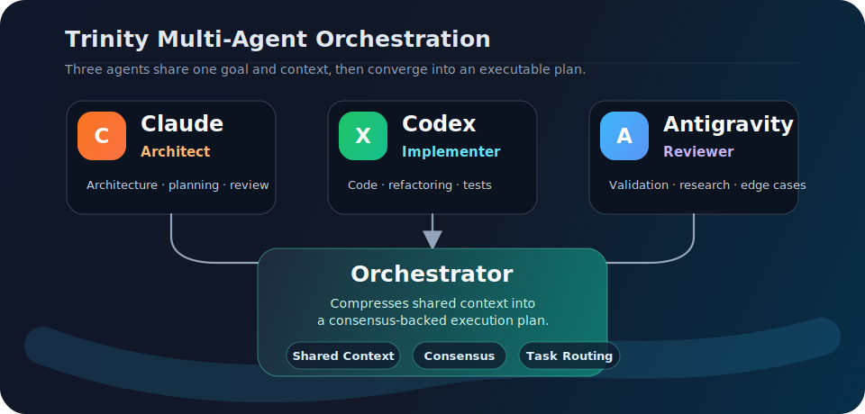
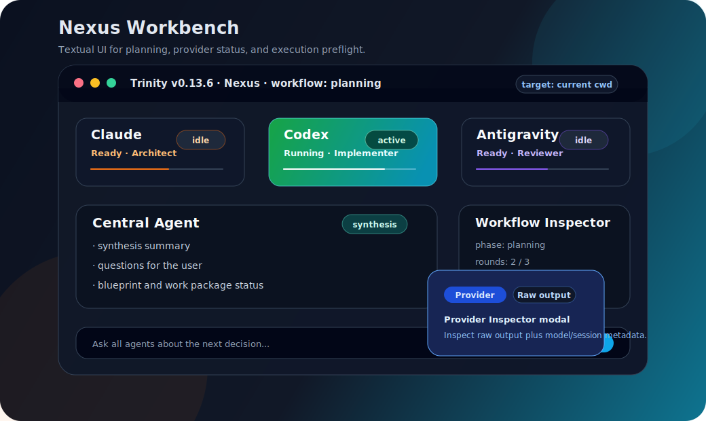

<div align="center">

◯ ─────────── ◯
# 🧠 T R I N I T Y
◯ ─────────── ◯

**Three minds, one context.**

Multi-agent AI orchestrator that unifies **Claude Code**, **Codex**, and **Antigravity CLI**
through shared context, round-based deliberation, and intelligent task distribution.

[](https://github.com/hongdangmoo49/Trinity/blob/main/LICENSE)
[](https://pypi.org/project/trinity-agent/)
[](https://www.python.org/)
[](https://github.com/hongdangmoo49/Trinity)

[한국어](./README.md) · [Quick Start](#-quick-start) · [Why Trinity](#-why-trinity) · [How It Works](#-how-it-works) · [Workflow](#-workflow-and-execution-model) · [TUI](#-interactive-tui) · [Commands](#-commands) · [Architecture](#-architecture)

</div>

---

> **Trinity transforms three AI coding agents into a single collaborative intelligence.**
>
> Instead of asking one AI to do everything, Trinity orchestrates a structured debate
> between Claude (Architect), Codex (Implementer), and Antigravity (Reviewer).
> They share context, discuss in rounds, reach consensus, and distribute tasks
> based on each agent's strengths.

---

## ❓ Why Trinity

Single-agent AI is powerful, but it has blind spots.

| Problem | What Happens | Trinity Fix |
| :--- | :--- | :--- |
| **Tunnel Vision** | One AI explores only one approach | Three agents debate alternatives before deciding |
| **No Peer Review** | Architectural flaws go unchecked | Antigravity reviews and challenges Claude's designs |
| **Context Loss** | Each agent works in isolation | Shared context file keeps everyone on the same page |
| **Uneven Quality** | Code quality depends on one model | Consensus mechanism ensures cross-verification |
| **Manual Delegation** | You decide who does what | Tasks auto-distribute based on agent strengths |

---

## 🚀 Quick Start

### Install

```bash
# Recommended: isolated CLI install
pipx install trinity-agent

# Or install into an environment you already manage
python -m pip install trinity-agent
```

### Fresh macOS Install

1. Install Python 3.10+ and `pipx`.

   ```bash
   brew install python pipx
   pipx ensurepath
   ```

2. Install Trinity.

   ```bash
   pipx install trinity-agent
   trinity --version
   ```

3. Install and authenticate the provider CLIs in the same macOS terminal
   environment. At least one provider is required; all three unlock the full
   multi-agent workflow.

   | Provider | Check command | Install/auth docs |
   | :--- | :--- | :--- |
   | Claude Code | `claude --version` | <https://docs.anthropic.com/en/docs/claude-code> |
   | Codex CLI | `codex --version` | <https://github.com/openai/codex> |
   | Antigravity CLI | `agy --version` | <https://antigravity.google/docs/cli-getting-started> |

4. Initialize and launch Trinity from your project directory.

   ```bash
   cd /path/to/your/project
   trinity init
   trinity bootstrap
   trinity
   ```

### Fresh Windows Install

The recommended Windows path is **WSL2 Ubuntu**. If you run Trinity in WSL,
install and authenticate Claude/Codex/Agy inside that same WSL environment.
Provider CLIs installed only in Windows PowerShell are not automatically
available inside WSL.

1. Install WSL2 Ubuntu from PowerShell.

   ```powershell
   wsl --install -d Ubuntu
   ```

2. In the Ubuntu terminal, install Python, `pipx`, and Trinity.

   ```bash
   sudo apt update
   sudo apt install -y python3 python3-pip python3-venv pipx
   pipx ensurepath
   pipx install trinity-agent
   trinity --version
   ```

3. Install provider CLIs in the same Ubuntu environment, authenticate them, and
   verify they are visible.

   ```bash
   claude --version
   codex --version
   agy --version
   ```

4. Initialize and launch from your project directory.

   ```bash
   cd ~/workspace/your-project
   trinity init
   trinity bootstrap
   trinity
   ```

Native Windows PowerShell is also possible. Install Python, then run
`py -m pip install --user pipx`, `py -m pipx ensurepath`, and
`pipx install trinity-agent`. Provider CLIs must also be installed on the
PowerShell-visible `PATH`.

### Initialize in Your Project

```bash
# Interactive setup wizard — detects installed AI CLIs and model choices
trinity init

# Non-interactive (uses defaults)
trinity init --non-interactive

# Check provider CLI auth/trust setup in the current terminal
trinity bootstrap
```

### Run Your First Deliberation

```bash
# One-shot question
trinity ask "Design the authentication system architecture"

# Textual Workbench (default)
trinity

# Legacy Rich/prompt_toolkit fallback
trinity --plain
```

That's it. Trinity will:
1. 🔍 Detect installed AI CLIs (Claude Code, Codex, Antigravity CLI)
2. 🧠 Start a round-based deliberation between available agents
3. 📊 Display results with consensus, task distribution, and reasoning

---

## 🔁 How It Works



### Deliberation Flow

| Phase | Action |
| :--- | :--- |
| **Initialize** | Store the goal, selected agents, model overrides, and observed provider sessions in workflow state |
| **Rounds** | Selected agents analyze the request and return opinions, risks, and implementation direction |
| **Central Synthesis** | The central agent summarizes and decides whether questions or a blueprint are needed |
| **User Decision** | Blocking questions pause in `NEEDS_USER_DECISION`; answers continue with the same target agents/models |
| **Blueprint Ready** | Executable work becomes work packages, and the user chooses `Execute` or refinement |
| **Execute/Review** | Target workspace preflight gates execution; each completed WP is reviewed by all non-owner agents |
| **Final Review/Replan** | Required final-review fixes become supplemental WPs and wait for another user-approved execution |

### Agent Strengths

| Agent | Role | Best At |
| :--- | :--- | :--- |
| 🏗️ **Claude** | Architect | Architecture, design, code review, complex logic, planning |
| ⚙️ **Codex** | Implementer | Implementation, coding, prototyping, refactoring, testing |
| 🔍 **Antigravity** | Reviewer | Testing, research, alternative exploration, edge cases, QA |

---

## 🧭 Workflow and Execution Model

Trinity `0.12.8` is built around a **persisted workflow** that separates
planning, execution, review, and replanning. A user request first goes through
round-based deliberation and central synthesis. Only after a blueprint is ready
does Trinity ask for an execution workspace and allow provider-managed file
writes.

```text
Prompt + selected agents/models
  -> WorkflowEngine.start()
  -> TrinityOrchestrator.ask()
  -> ProviderReadinessGate
  -> DeliberationProtocol rounds
  -> Central synthesis
  -> NEEDS_USER_DECISION or BLUEPRINT_READY
  -> Execute preflight
  -> ExecutionProtocol.run()
  -> WP non-owner peer reviews
  -> Review repair loop or Final review
  -> Final-review auto replan or DONE
```

Important runtime rules:

- **Persisted state** - `.trinity/workflow/session.json` and `events.jsonl` store
  workflow state, open questions, user decisions, blueprints, work packages,
  execution results, provider session IDs, and runtime model observations.
- **Target/model continuity** - agent selections and non-default model overrides
  from Start/Nexus, `/ask`, or `/model` are stored on the workflow and reused
  after question answers.
- **Provider invocation** - one-shot transport is the default. Claude uses
  `claude -p`, Codex uses `codex exec --json`, and Antigravity uses `agy --print`.
  Raw and cleaned response artifacts are stored under `.trinity/responses/`. When
  a provider returns a session ID, Trinity maps it to the worker agent or central
  synthesis owner such as `central:codex` so resumed workflows can continue that
  provider-native session.
- **Model discovery** - `trinity init` and Textual `/model` load model choices
  from live CLIs where possible. Codex uses `codex debug models`, Antigravity
  uses `agy models`, and Claude uses a static fallback because the Claude CLI
  does not expose a non-interactive model-list command.
- **Question loop** - blocking questions move the workflow to
  `NEEDS_USER_DECISION`; answers are recorded and used to continue deliberation.
- **Execution boundary** - provider writes require a target workspace. Writing
  inside the Trinity control repo is refused unless explicitly confirmed.
- **Safe parallelism** - work packages run only when dependencies and expected
  file ownership make parallel execution safe.
- **WP review** - after a WP completes, every active non-owner agent reviews it.
  Single-agent sessions fall back to self-review.
- **Final review** - final project review falls back in `codex -> claude ->
  antigravity` order. Required bugfix/validation items are automatically
  converted into `WP-S###` supplemental packages and the workflow returns to
  `BLUEPRINT_READY` for another user-approved execution.
- **Recovery and retry** - `/resume` restores saved workflows, and
  `/execute-retry` restarts failed, blocked, interrupted, or custom-selected
  work packages.
- **Memory management** - raw logs and artifacts are preserved, while
  `/memory compact` and shared-context projection keep provider prompts bounded.
- **UI boundary** - Textual Workbench is a projection layer. The runtime remains
  in `WorkflowEngine`, `TrinityOrchestrator`, and `ExecutionProtocol`.

For current workflow differences and command behavior, see
[the README workflow review](docs/plans/2026-06-11-readme-workflow-install-review.md)
and the [Slash Command Reference](docs/slash-command-reference.md).

---

## 💬 Interactive TUI

Trinity now launches a **Textual-based Workbench TUI** by default. You can write
long multi-line prompts, compare Claude/Codex/Antigravity status panels, and let
the central synthesis view organize questions and consensus. File changes only
start after you choose `Execute` and approve the workspace preflight.



### TUI Features

- **Start Screen** — begin planning with a large multi-line prompt; workspace is optional.
- **Nexus Screen** — provider status panels, central synthesis, and workflow inspector.
- **Agent Target Row** — choose which of Claude/Codex/Antigravity receives the
  next prompt from Start or Nexus, then configure provider models with `/model`.
- **Provider Inspector** — tabbed modal for raw Claude/Codex/Antigravity output.
- **Execution Preflight** — workspace picker and path/git/write checks only when `Execute` is selected.
- **Execution Matrix** — work package DataTable plus execution log.
- **Resume/Retry** — restore saved workflows with `/resume` and use the
  `/execute-retry` modal to retry failed, blocked, or interrupted WPs.
- **Theme Settings** — save theme mode, density, motion, and Unicode rendering preferences.
- **Startup Update Check** — when `trinity` starts, it can ask whether to apply an
  available update; use `--skip-update-check` to bypass this check.
- **Plain fallback** — use `trinity --plain` or `TRINITY_TUI=plain` for the legacy Rich/prompt_toolkit UI.

---

## 📋 Commands

### CLI Commands

| Command | Description |
| :--- | :--- |
| `trinity` | Launch Textual Workbench TUI |
| `trinity --plain` | Launch legacy Rich/prompt_toolkit TUI fallback |
| `trinity init` | Initialize `.trinity/` in current directory |
| `trinity init --non-interactive` | Initialize with defaults (no prompts) |
| `trinity bootstrap` | Run provider first-use auth/trust setup sequentially in the current terminal |
| `trinity bootstrap --check-only` | Check provider CLI installation without launching providers |
| `trinity ask "question"` | One-shot deliberation on a prompt |
| `trinity status` | Show agent status table |
| `trinity doctor` | Diagnose OS, terminal, provider CLI, and transport state |
| `trinity status-watch` | Live-updating status dashboard |
| `trinity context` | Display shared context |
| `trinity config [key]` | Show configuration values |
| `trinity logs` | View orchestrator logs (`--follow` uses Python, not POSIX tail) |
| `trinity reset --keep-context` | Reset session (preserve context) |
| `trinity bootstrap --legacy-tmux` | Start a legacy/debug tmux bootstrap session |
| `trinity attach` | Attach to a legacy `transport_mode = "tmux"` session |

### TUI Inline Commands

Inside the interactive TUI (`trinity` with no args). For detailed behavior and
the current Textual Workbench palette limitations, use the
[Slash Command Reference](docs/slash-command-reference.md).

| Command | Description |
| :--- | :--- |
| `<text>` | Ask agents to deliberate on a topic |
| `/status` | Show agent status |
| `/context` | Show current-session goal, synthesis, questions, decisions, and work package summary |
| `/rounds [N]` | Set max deliberation rounds (1–20) |
| `/agent <name> on\|off` | Enable/disable an agent |
| `/model` | Open the per-agent model selection modal and set model overrides |
| `/history` | Show deliberation history |
| `/save` | Save session results to file |
| `/caveman [on\|off\|lite\|full\|ultra]` | Inspect or change concise output compression |
| `/workflow` | Show workflow state, target workspace, and package summary |
| `/questions [--select --all]` | Show pending questions or open the selection wizard |
| `/answer <id\|n\|next> <text>` | Answer a workflow question and continue when needed |
| `/ask <all\|agent[,agent...]> [--model MODEL] <text>` | Ask only selected agents or send a targeted follow-up |
| `/decisions` | Show recorded workflow decisions |
| `/packages` | Show generated work packages |
| `/subtasks` | Show provider-internal subtask results |
| `/report [save]` | Show the deliberation report or save it as Markdown |
| `/resume [N\|latest\|ID]` | Select and resume a saved workflow session |
| `/execute [text]` | Execute the ready blueprint in the target workspace |
| `/execute-retry [all\|failed\|blocked\|interrupted\|custom\|WP-ID...]` | Retry failed, blocked, or interrupted work packages |
| `/review [wp\|final\|all] [WP-ID...]` | Run pending WP review or final project review |
| `/improve [all\|critical\|high\|AI-ID...\|done\|text]` | Select final-review follow-up work or queue supplemental WPs |
| `/target [path\|clear]` | Show, set, or clear the implementation target workspace |
| `/memory [stats\|compact]` | Show or compact shared context memory |
| `/artifact <memory-id>` | Show an indexed memory artifact reference |
| `/help` | Show help |
| `/quit`, `/exit`, `/q` | Exit Trinity |

The TUI starts with a new workflow session by default. The previous active
workflow is preserved in `.trinity/workflow/history/` and can be resumed
explicitly with `/resume`.

---

## ⚙️ Configuration

Edit `.trinity/trinity.config` (TOML format):

`trinity init` asks which model each agent should use and stores the matching
`context_budget` for known models. The interactive wizard proposes installed
providers as enabled by default. `model = "default"` keeps the local CLI's
default model and applies Trinity's conservative provider default budget.
The `trinity init --non-interactive` fallback config can still leave optional
providers disabled until they are explicitly configured.

```toml
[general]
session_name = "trinity"
lang = "en"
state_dir = ".trinity"
max_deliberation_rounds = 5
consensus_threshold = 0.6

[deliberation]
max_rounds = 5
consensus_threshold = 0.6
round_timeout_seconds = 120
execution_timeout_seconds = 1800

[context]
rotate_threshold = 0.6
keep_sections = ["## Current Goal", "## Agreed Conclusion"]
recent_rounds_on_rotate = 3
summary_max_tokens = 500
prompt_compression_enabled = true
prompt_compression_round_threshold = 2
prompt_compression_max_summary_tokens = 200
caveman_mode = true
caveman_intensity = "full"

[agents.claude]
provider = "claude-code"
cli_command = "claude"
model = "default"
context_budget = 200000
role_prompt = "You are the Architect. You design systems, review code..."
enabled = true
extra_args = ["--dangerously-skip-permissions"]

[agents.codex]
provider = "codex"
cli_command = "codex"
model = "default"
context_budget = 128000
role_prompt = "You are the Implementer. You write clean, efficient code..."
enabled = true                     # When selected in interactive init

[agents.antigravity]
provider = "antigravity-cli"
cli_command = "agy"
model = "default"
context_budget = 1000000
role_prompt = "You are the Reviewer. You explore alternatives..."
enabled = true                     # When selected in interactive init
```

---

## 🏗️ Architecture

```
trinity/
├── orchestrator.py         # Top-level coordinator — owns all components
├── cli.py                  # Click-based CLI entry point
├── config.py               # TOML config loader with defaults
├── models.py               # Core dataclasses (AgentSpec, DeliberationMessage, etc.)
│
├── agents/                 # Provider-specific agent wrappers
│   ├── base.py             #   AgentWrapper ABC
│   ├── claude_agent.py     #   Claude Code (print mode + interactive tmux)
│   ├── codex_agent.py      #   Codex (print mode + interactive tmux)
│   ├── antigravity_agent.py #   Antigravity CLI (one-shot print mode)
│   └── factory.py          #   AgentFactory — creates agents by provider
│
├── deliberation/           # The debate engine
│   ├── protocol.py         #   Round-based deliberation loop with event streaming
│   ├── consensus.py        #   Keyword-based agreement detection + negation filter
│   └── distributor.py      #   Maps consensus → agent tasks by strengths
│
├── workflow/               # Persisted workflow state machine
│   ├── engine.py           #   Questions, decisions, blueprints, and state transitions
│   ├── execution.py        #   Dependency-safe dispatch and workspace guards
│   ├── decomposer.py       #   Blueprint to executable work-package decomposition
│   ├── ledger.py           #   Renders workflow state back into shared.md
│   └── review.py           #   Peer review package planning
│
├── providers/              # One-shot provider invocation layer
│   ├── invoker.py          #   Normalizes Claude/Codex/Antigravity CLI calls
│   ├── readiness.py        #   Auth/model-loading/prompt readiness checks
│   ├── policy.py           #   Read-only/workspace-write access and parallel policy
│   └── bootstrap.py        #   Provider auth/trust setup helpers
│
├── context/                # Shared brain
│   ├── shared.py           #   SharedContextEngine — manages shared.md
│   ├── monitor.py          #   Token usage tracking per agent
│   └── rotator.py          #   Auto session rotation when context fills
│
├── completion/             # How we know an agent finished responding
│   ├── base.py             #   CompletionDetector ABC + FallbackChainDetector
│   ├── hook.py             #   Claude stop-hook file signal
│   ├── idle.py             #   Output stops changing detector
│   └── prompt.py           #   CLI prompt reappears detector
│
├── textual_app/            # Textual Workbench UI
│   ├── app.py              #   TrinityTextualApp — screen router and app shell
│   ├── screens/            #   Start, Nexus, Execution Matrix, Settings
│   ├── widgets/            #   composer, provider panels, inspector, workspace picker
│   ├── snapshot.py         #   read-only workflow/shared.md projection
│   └── settings.py         #   user UI theme preferences
│
├── tui/                    # Legacy/plain interactive terminal UI
│   ├── app.py              #   TrinityTUI — Rich Live rendering engine
│   ├── session.py          #   InteractiveSession — input loop + event-driven updates
│   ├── events.py           #   TUIEventBus — thread-safe event bridge
│   └── theme.py            #   Per-agent visual themes (color, icon, role)
│
├── setup/                  # First-run experience
│   ├── detector.py         #   Auto-detect installed AI CLIs
│   └── wizard.py           #   Rich interactive setup wizard
│
├── tmux/                   # Interactive mode infrastructure
│   ├── pane.py             #   Low-level tmux pane I/O
│   ├── session.py          #   Session/pane lifecycle management
│   └── layout.py           #   TUI + agent split layout
│
├── workspace/              # Agent isolation
│   ├── isolation.py        #   Git worktree per agent (parallel editing)
│   └── managed_home.py     #   Per-agent isolated HOME directories
│
├── platform/               # Cross-platform terminal/process/log helpers
├── bridge/                 # L2 bridge routing example/domain module
│
├── health/
│   └── checker.py          #   Agent health monitoring
│
├── retry.py                #   RetryConfig with exponential backoff + jitter
└── error_handler.py        #   Crash recovery and agent respawn
```

### Key Design Decisions

| Decision | Rationale |
| :--- | :--- |
| **Shared markdown file** | Agents read/write `shared.md` — simple, transparent, debuggable |
| **Round-based protocol** | Structured debate prevents circular arguments; forces progression |
| **Textual Workbench default UI** | Start/Nexus/Execution Matrix screens separate planning from execute; provider output is inspected on demand |
| **Persisted workflow state** | Questions, decisions, blueprints, target workspace, and execution results are stored for resume and debugging |
| **Target workspace guard** | Provider workspace-write is separated from the Trinity control repo unless explicitly confirmed |
| **Event-driven fallback TUI** | `asyncio.wait(FIRST_COMPLETED)` + `Queue` keeps the legacy/plain UI responsive |
| **Keyword consensus** | Fast, deterministic agreement detection with negation filtering |
| **Provider-agnostic agents** | `AgentWrapper` ABC — easy to add new AI providers |
| **Two execution modes** | Default one-shot provider calls plus legacy/debug tmux transport |

---

## 🔧 Prerequisites

| Requirement | Why | Required |
| :--- | :--- | :--- |
| **Python 3.10+** | Runtime | ✅ Yes |
| **Claude Code CLI** | Architect agent | Optional |
| **Codex CLI** | Implementer agent | Optional |
| **Antigravity CLI** | Reviewer agent | Optional |
| **tmux** | Legacy/debug transport or `bootstrap --legacy-tmux` | Optional |

> You need at least **one** AI CLI installed. Trinity auto-detects what's available during `trinity init`.

---

## 🧪 Development

```bash
# Clone and setup
git clone https://github.com/hongdangmoo49/Trinity.git
cd Trinity
uv sync

# Run tests
uv run pytest tests/ -v

# Run with coverage
uv run pytest tests/ --cov=trinity --cov-report=term-missing
```

### Publishing

```bash
# After bumping pyproject.toml + src/trinity/__init__.py
uv build
uv publish --token <PYPI_TOKEN>
```

---

## 📊 Project Stats

| Metric | Value |
| :--- | :--- |
| **Version** | 0.12.8 |
| **Tests** | Run the full suite with `uv run pytest` |
| **Coverage** | ~87% |
| **Source files** | 100+ |
| **Test files** | 70+ |
| **Dependencies** | `click`, `rich`, `prompt_toolkit`, `textual`, `tomli`, `tomli-w` |
| **Python** | 3.10+ |

---

## 📄 License

MIT License — see [LICENSE](https://github.com/hongdangmoo49/Trinity/blob/main/LICENSE).

---

<div align="center">

*"Three minds are better than one."*

**Trinity** — [`GitHub`](https://github.com/hongdangmoo49/Trinity) · [`PyPI`](https://pypi.org/project/trinity-agent/) · [`Issues`](https://github.com/hongdangmoo49/Trinity/issues)

</div>
