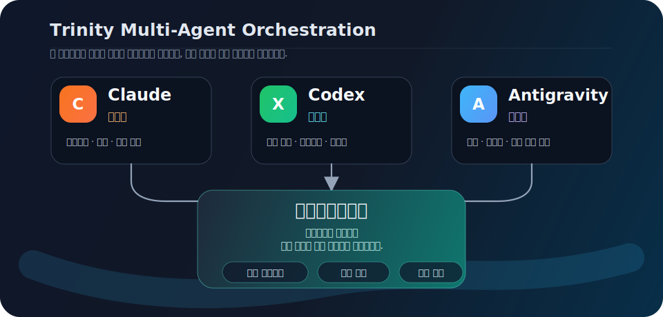
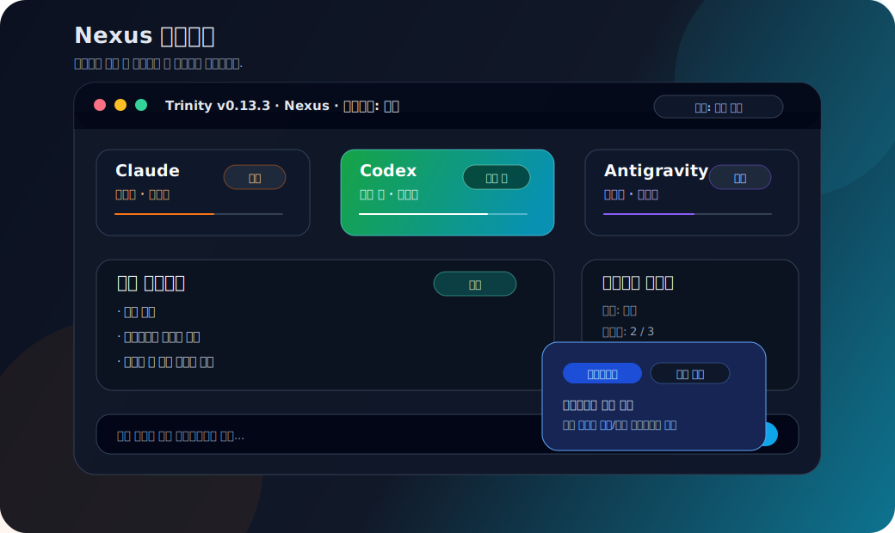

<div align="center">

◯ ─────────── ◯
# 🧠 T R I N I T Y
◯ ─────────── ◯

**세 개의 두뇌, 하나의 컨텍스트.**

**Claude Code** · **Codex** · **Antigravity CLI** 세 AI 에이전트를
공유 컨텍스트, 라운드 기반 토론, 지능형 작업 분배로 통합하는
멀티 에이전트 AI 오케스트레이터.

[](https://github.com/hongdangmoo49/Trinity/blob/main/LICENSE)
[](https://pypi.org/project/trinity-agent/)
[](https://www.python.org/)
[](https://github.com/hongdangmoo49/Trinity)

[English](./README.en.md) · [빠른 시작](#-빠른-시작) · [왜 Trinity인가](#-왜-trinity인가) · [작동 원리](#-작동-원리) · [워크플로우](#-워크플로우와-실행-모델) · [TUI](#-대화형-tui) · [명령어](#-명령어) · [아키텍처](#-아키텍처)

</div>

---

> **Trinity는 서로 다른 역할을 가진 세 가지 AI 코딩 에이전트를 하나의 강력한 협업 지능으로 통합합니다.**
>
> 단 하나의 AI에게 모든 작업을 일임하는 기존 방식에서 벗어나, Trinity는 Claude(설계자), Codex(구현자), Antigravity(검토자) 간의 **구조화된 토론과 합의**를 지능적으로 조율합니다. 세 에이전트는 하나의 컨텍스트를 공유하며 라운드별로 의견을 나누고, 최종 합의에 도달하면 각자의 특화 분야에 맞게 작업을 자동으로 분배하여 처리합니다.

---

## ❓ 왜 Trinity인가

단일 에이전트 AI는 강력하지만, 몇 가지 치명적인 맹점이 있습니다.

| 문제 유형 | 단일 AI 환경에서 발생하는 현상 | Trinity의 해결 방식 |
| :--- | :--- | :--- |
| **터널 비전 (시야 협착)** | 하나의 AI가 오직 한 가지 접근 방식에만 갇혀 생각합니다. | 세 에이전트가 최종 결정을 내리기 전에 다각도에서 대안을 토론합니다. |
| **피어 리뷰(Peer Review) 부재** | 설계상 결함이나 잠재적 버그가 검증 없이 바로 통과되어 반영됩니다. | Antigravity가 Claude의 초기 설계안을 정밀하게 검토하고 보완책을 요구합니다. |
| **컨텍스트 단절 (유실)** | 각 에이전트가 서로 분리된 환경에서 고립되어 작업해 동기화가 깨집니다. | 단일 공유 컨텍스트 파일을 통해 모든 에이전트가 일관된 개발 맥락을 실시간 유지합니다. |
| **일관되지 못한 품질** | 결과물의 완성도가 단일 모델의 한계나 컨디션에 전적으로 의존합니다. | 다수결 합의(Consensus) 메커니즘을 도입하여 상호 교차 검증된 품질만을 보장합니다. |
| **수동 작업 위임** | 어떤 에이전트에게 어떤 하위 작업을 맡길지 사용자가 매번 직접 지정해야 합니다. | 각 에이전트의 강점과 역할에 맞춰 하위 작업이 시스템적으로 자동 분배됩니다. |

---

## 🚀 빠른 시작

### 실행 전제 조건

Trinity는 로컬 터미널에서 provider CLI를 직접 호출하는 프로그램입니다.
따라서 `trinity`를 실행하는 **같은 로컬 셸/환경**에 다음 CLI 중 하나 이상이
설치되어 있고 로그인되어 있어야 합니다.

- Claude Code CLI (`claude`)
- Codex CLI (`codex`)
- Antigravity CLI (`agy`)

Trinity 패키지만 설치된 상태에서도 앱은 실행할 수 있지만, 위 provider CLI가 하나도
없으면 실제 에이전트를 소집할 수 없습니다. 한 개만 설치해도 시작할 수 있고,
여러 개를 설치하면 더 완전한 multi-agent 토론과 리뷰 흐름을 사용할 수 있습니다.

### 설치하기

```bash
# 권장: 격리된 CLI 설치
pipx install trinity-agent

# 또는 이미 관리 중인 Python 환경에 설치
python -m pip install trinity-agent
```

### macOS 새 환경에서 설치하기

1. Python 3.10 이상과 `pipx`를 준비합니다.

   ```bash
   brew install python pipx
   pipx ensurepath
   ```

2. Trinity를 설치합니다.

   ```bash
   pipx install trinity-agent
   trinity --version
   ```

3. 같은 macOS 터미널 환경에 사용할 provider CLI를 하나 이상 설치하고 로그인합니다.
   세 개를 모두 설치하면 Trinity의 전체 multi-agent 흐름을 사용할 수 있습니다.

   | Provider | 확인 명령 | 설치/인증 문서 |
   | :--- | :--- | :--- |
   | Claude Code | `claude --version` | <https://docs.anthropic.com/en/docs/claude-code> |
   | Codex CLI | `codex --version` | <https://github.com/openai/codex> |
   | Antigravity CLI | `agy --version` | <https://antigravity.google/docs/cli-getting-started> |

4. 프로젝트 폴더에서 Trinity를 초기화하고 실행합니다.

   ```bash
   cd /path/to/your/project
   trinity init
   trinity bootstrap
   trinity
   ```

### Windows 새 환경에서 설치하기

권장 경로는 **WSL2 Ubuntu**입니다. Trinity를 WSL에서 실행한다면 Claude/Codex/Agy도
같은 WSL 안에 설치하고 인증해야 합니다. Windows PowerShell에 설치된 provider CLI는
WSL 내부에서 자동으로 공유되지 않습니다.

1. PowerShell에서 WSL2 Ubuntu를 설치합니다.

   ```powershell
   wsl --install -d Ubuntu
   ```

2. Ubuntu 터미널에서 Python과 `pipx`를 준비하고 Trinity를 설치합니다.

   ```bash
   sudo apt update
   sudo apt install -y python3 python3-pip python3-venv pipx
   pipx ensurepath
   pipx install trinity-agent
   trinity --version
   ```

3. 같은 Ubuntu 환경에 사용할 provider CLI를 하나 이상 설치하고 로그인한 뒤 확인합니다.
   아래 명령 중 실제로 설치한 CLI가 하나 이상 성공하면 됩니다.

   ```bash
   claude --version  # Claude Code CLI를 설치한 경우
   codex --version   # Codex CLI를 설치한 경우
   agy --version     # Antigravity CLI를 설치한 경우
   ```

4. 작업할 프로젝트 폴더에서 초기화하고 실행합니다.

   ```bash
   cd ~/workspace/your-project
   trinity init
   trinity bootstrap
   trinity
   ```

Native Windows PowerShell에서 실행할 수도 있습니다. 이 경우 Python을 설치한 뒤
PowerShell에서 `py -m pip install --user pipx`, `py -m pipx ensurepath`,
`pipx install trinity-agent` 순서로 설치하고, provider CLI도 PowerShell에서 인식되는
PATH에 설치해야 합니다.

### 프로젝트 초기화

```bash
# 대화형 설정 마법사 실행 — 설치된 AI CLI와 모델 목록을 자동 탐색합니다
trinity init

# 비대화형 실행 (기본 설정값 적용)
trinity init --non-interactive

# 현재 터미널에서 각 provider CLI의 auth/trust 초기 설정을 확인합니다
trinity bootstrap
```

### 신규/기존 프로젝트 시작 흐름

기존 코드베이스에서 시작할 때는 현재 폴더를 Trinity 작업 공간으로 초기화한 뒤
프로젝트 컨텍스트를 확인합니다.

```bash
cd /path/to/existing-project
trinity init --mode existing
trinity project status
trinity
```

프로젝트 구조가 바뀌었거나 테스트 명령을 다시 감지해야 하면 저장된 프로젝트 컨텍스트를
갱신합니다. `--refresh`는 기존의 mode, target workspace, notes를 유지한 채
`.trinity/project-intake.json`과 `.trinity/project-intake.md`를 다시 씁니다.

```bash
trinity project status --refresh
```

새 프로젝트를 만들 때는 Trinity 상태를 저장할 위치에서 초기화한 뒤 대상 폴더를
생성합니다. `trinity init --mode new`는 현재 폴더를 작업 대상으로 확정하지 않고,
`trinity project new`가 실행된 뒤 신규 프로젝트 컨텍스트를 기록합니다.

```bash
mkdir -p ~/workspace/trinity-control
cd ~/workspace/trinity-control
trinity init --mode new
trinity project new my-app --parent ~/workspace --git
trinity project status
trinity
```

자동화나 CI에서는 `--json`으로 저장된 프로젝트 컨텍스트와 현재 분석 상태를 확인할 수 있습니다.

```bash
trinity project status --json
```

### 첫 번째 토론(Deliberation) 실행

```bash
# 단발성(One-shot) 질의 실행
trinity ask "인증 시스템 아키텍처를 설계해줘"

# Textual Workbench 실행 (기본)
trinity

# 기존 Rich/prompt_toolkit TUI fallback
trinity --plain
```

Trinity가 백그라운드에서 다음 단계를 자동으로 수행합니다:
1. 🔍 호스트 시스템에 설치된 AI CLI 자동 탐색 (Claude Code, Codex, Antigravity CLI 등)
2. 🧠 사용 가능한 에이전트들을 소집하여 라운드 기반의 심층 토론(Deliberation) 시작
3. 📊 에이전트 간의 합의 도출 과정, 작업 분배 결과, 추론 과정을 아름다운 TUI로 시각화

---

## 🔁 작동 원리



### 토론 흐름 (Deliberation Flow)

| 단계 | 수행 항목 및 동작 설명 |
| :--- | :--- |
| **초기화 (Initialize)** | 사용자 목표, 선택 agent, 모델 override, provider session 관찰값을 workflow 상태로 저장합니다. |
| **협의 라운드 (Rounds)** | 선택된 에이전트가 사용자 요청을 분석하고 초기 의견, 리스크, 구현 방향을 반환합니다. |
| **중앙 합성 (Central Synthesis)** | 중앙 에이전트가 응답을 요약·분석해 질문이 필요한지, blueprint를 만들 수 있는지 판단합니다. |
| **사용자 결정 (Decision)** | 질문이 있으면 `NEEDS_USER_DECISION`에서 멈추고, 답변 후 같은 대상 agent/model로 협의를 이어갑니다. |
| **Blueprint 준비 (Blueprint Ready)** | 실행 가능한 작업이면 work package를 만들고, 사용자가 `Execute` 또는 보강을 선택할 수 있게 합니다. |
| **실행과 리뷰 (Execute/Review)** | Target workspace preflight 후 WP를 실행하고, 각 WP는 모든 non-owner agent에게 리뷰받습니다. |
| **최종 리뷰와 재계획 (Final Review/Replan)** | 전체 리뷰에서 필수 수정이 나오면 supplemental WP를 자동 생성하고 다시 사용자 승인 대기 상태로 돌아갑니다. |

### 에이전트별 특기 분야(강점)

| 에이전트 | 지정 역할 | 주요 작업 및 강점 분야 |
| :--- | :--- | :--- |
| 🏗️ **Claude** | 설계자 (Architect) | 전체 아키텍처 및 시스템 설계, 설계 검토(코드 리뷰), 복잡한 비즈니스 로직 설계, 개발 기획 |
| ⚙️ **Codex** | 구현자 (Implementer) | 실제 코드 구현 및 프로토타이핑, 코드 리팩토링, 단위 테스트 코드 작성 |
| 🔍 **Antigravity** | 검토자 (Reviewer) | 코드 동작 검증, 기술 스택 연구, 대안 탐색, 경계 조건(Edge Case) 분석, 품질 보증(QA) |

---

## 🧭 워크플로우와 실행 모델

Trinity `0.12.9`의 핵심은 **planning, execution, review, replan을 분리한
persisted workflow**입니다. 사용자의 요구사항은 먼저 라운드 기반 deliberation과
central synthesis를 거쳐 질문, 결정, blueprint, work package로 정리됩니다.
실제 파일 변경은 blueprint가 준비된 뒤 사용자가 `Execute`를 선택하고 target
workspace preflight를 통과해야 시작됩니다.

```text
Prompt + selected agents/models
  → WorkflowEngine.start()
  → TrinityOrchestrator.ask()
  → ProviderReadinessGate
  → DeliberationProtocol rounds
  → Central synthesis
  → NEEDS_USER_DECISION 또는 BLUEPRINT_READY
  → Execute preflight
  → ExecutionProtocol.run()
  → WP non-owner peer reviews
  → Review repair loop 또는 Final review
  → Final-review auto replan 또는 DONE
```

주요 동작 규칙:

- **상태 저장** — `.trinity/workflow/session.json`과 `events.jsonl`에 workflow 상태,
  open question, user decision, blueprint, work package, 실행 결과, provider
  session id, runtime model 관찰값을 저장합니다.
- **대상 에이전트와 모델 유지** — Start/Nexus의 대상 선택, `/ask`, `/model`에서
  고른 agent/model override는 workflow에 저장되고 질문 답변 이후에도 이어집니다.
- **Provider 호출** — 기본 호출은 one-shot입니다. Claude는 `claude -p`,
  Codex는 `codex exec --json`, Antigravity는 `agy --print`로 호출되고,
  raw/clean response artifact가 `.trinity/responses/`에 남습니다. Provider가
  session id를 반환하면 worker agent와 central synthesis(`central:codex` 등)에
  매핑해 resume 이후에도 이어갈 수 있게 저장합니다.
- **모델 탐색** — `trinity init`과 Textual `/model`은 가능한 경우 실제 CLI에서
  모델 목록을 가져옵니다. Codex는 `codex debug models`, Antigravity는 `agy models`를
  사용하며, Claude는 CLI 모델 목록 명령이 없어 정적 fallback을 사용합니다.
- **질문 루프** — synthesis가 blocking question을 만들면 workflow는
  `NEEDS_USER_DECISION`에서 멈추고, 답변이 기록되면 decision continuation prompt로
  다시 deliberation을 이어갑니다.
- **실행 경계** — provider가 파일을 쓰려면 target workspace가 필요합니다. Trinity
  control repo 내부 쓰기는 명시적 확인 없이는 차단됩니다.
- **병렬 실행** — work package dependency와 예상 파일 소유권을 기준으로 안전한
  병렬 batch만 실행합니다.
- **WP 리뷰** — WP가 완료되면 해당 WP를 수행하지 않은 모든 active agent가 리뷰합니다.
  단일 agent 세션에서는 self-review로 대체됩니다.
- **Final review** — 전체 실행 후 최종 리뷰는 `codex → claude → antigravity` 순서로
  fallback합니다. 필수 bugfix/validation 항목이 나오면 중앙 workflow가 `WP-S###`
  supplemental package를 자동으로 만들고 다시 `BLUEPRINT_READY`로 돌려, 사용자가
  다음 실행을 승인할 수 있게 합니다.
- **복구와 재시도** — `/resume`은 저장된 workflow를 복원하고, `/execute-retry`는
  failed/blocked/interrupted/custom package를 골라 새 execution run으로 재시도합니다.
- **메모리 관리** — 원본 로그와 artifact는 보존하되, `/memory compact`와 shared
  context projection으로 provider prompt에 들어가는 정보를 압축합니다.
- **UI 역할** — Textual Workbench는 workflow/orchestrator를 새로 구현하지 않고,
  `TextualWorkflowController`가 기존 engine을 background thread에서 실행한 뒤
  snapshot으로 투영합니다.

상세한 상태 전이 차이는
[README workflow review](docs/plans/2026-06-11-readme-workflow-install-review.md)와
[Slash Command Reference](docs/slash-command-reference.md)를 참고하세요.

---

## 💬 대화형 TUI

Trinity는 기본 실행 화면으로 **Textual 기반 Workbench TUI**를 제공합니다.
긴 요구사항을 multi-line으로 작성하고, Claude/Codex/Antigravity 상태를
분리해서 보며, 중앙 synthesis가 질문과 합의 상태를 정리합니다. 실제 파일
변경은 `Execute`를 누른 뒤 workspace preflight를 승인해야 시작됩니다.



### TUI 주요 기능

- **Start Screen** — workspace를 필수로 묻지 않고 큰 multi-line prompt로 planning을 시작합니다.
- **Nexus Screen** — provider별 상태 패널, 중앙 synthesis, workflow inspector를 한 화면에 보여줍니다.
- **Agent Target Row** — Start/Nexus 입력창에서 Claude/Codex/Antigravity 중 질문할
  대상을 고르고, `/model` modal에서 provider별 모델을 세부 설정합니다.
- **Provider Inspector** — Claude/Codex/Antigravity 원문 output을 탭 modal에서 확인합니다.
- **Execution Preflight** — `Execute` 시점에만 workspace picker와 경로/git/write 권한 preflight를 보여줍니다.
- **Execution Matrix** — work package DataTable과 execution log를 모니터링 화면으로 표시합니다.
- **Resume/Retry** — `/resume`으로 이전 workflow를 복원하고 `/execute-retry` modal에서
  실패, 차단, 중단된 WP를 선택해 재시도합니다.
- **Theme Settings** — 앱 안에서 theme mode, density, motion, Unicode rendering preference를 저장합니다.
- **Startup Update Check** — `trinity` 실행 시 업데이트가 있으면 적용 여부를 묻고,
  `--skip-update-check`로 건너뛸 수 있습니다.
- **Plain fallback** — `trinity --plain` 또는 `TRINITY_TUI=plain`으로 기존 Rich/prompt_toolkit TUI를 사용할 수 있습니다.

---

## 📋 명령어

### CLI 명령어

| 명령어 | 설명 |
| :--- | :--- |
| `trinity` | Textual Workbench TUI 실행 |
| `trinity --plain` | 기존 Rich/prompt_toolkit TUI fallback 실행 |
| `trinity init` | 현재 디렉토리에 Trinity 작업 공간(`.trinity/`) 초기화 |
| `trinity init --non-interactive` | 사용자 입력 요청 없이 기본값으로 즉시 초기화 |
| `trinity bootstrap` | 현재 터미널에서 provider CLI 초기 설정/auth/trust를 순차 실행 |
| `trinity bootstrap --check-only` | provider CLI 설치 상태만 확인하고 실행하지 않음 |
| `trinity project analyze [PATH]` | 기존 프로젝트를 분석해 프로젝트 컨텍스트 기록 |
| `trinity project new NAME` | 신규 대상 프로젝트 폴더를 생성하고 프로젝트 컨텍스트 기록 |
| `trinity project status [--json] [--refresh]` | 저장된 프로젝트 컨텍스트 확인, JSON 출력, 재분석 |
| `trinity ask "질문"` | 입력한 프롬프트에 대해 즉시 단발성(One-shot) 토론 실행 |
| `trinity status` | 현재 에이전트들의 활성화 및 연결 상태를 표 형태로 표시 |
| `trinity doctor` | OS/터미널/provider CLI/transport 상태를 진단 |
| `trinity status-watch` | 실시간으로 상태가 갱신되는 상태 모니터 대시보드 실행 |
| `trinity context` | 공유 컨텍스트(shared.md) 파일 내용 확인 |
| `trinity config [키]` | 지정한 키에 해당하는 환경 설정값 조회 |
| `trinity logs` | 오케스트레이터의 세부 동작 로그 확인 (`--follow`는 Python 구현 사용) |
| `trinity reset --keep-context` | 현재 세션 정보는 초기화하되, 기존 공유 컨텍스트 파일은 보존 |
| `trinity bootstrap --legacy-tmux` | legacy/debug용 tmux bootstrap 세션 실행 |
| `trinity attach` | legacy `transport_mode = "tmux"` 세션에 연결 |

### TUI 인라인 명령어

대화형 TUI 내부 명령 (인자 없이 `trinity` 실행 후 프롬프트 상에서 입력).
세부 동작 방식과 Textual Workbench 팔레트의 현재 한계는
[Slash Command Reference](docs/slash-command-reference.md)를 기준으로 한다.

| 명령어 | 설명 |
| :--- | :--- |
| `<텍스트>` | 에이전트들에게 새로운 주제로 토론(Deliberation) 시작 요청 |
| `/status` | 에이전트별 상세 상태 대시보드 표시 |
| `/context` | 현재 세션의 목표, 합의, 질문, 결정, 작업 패키지 요약 확인 |
| `/rounds [N]` | 토론을 진행할 최대 라운드 횟수 설정 (1–20 범위) |
| `/agent <이름> on\|off` | 특정 에이전트를 즉시 활성화하거나 비활성화 |
| `/model` | 에이전트별 모델 선택 modal을 열고 다음 요청의 모델 override 설정 |
| `/history` | 이전 라운드의 토론 히스토리 요약 조회 |
| `/save` | 현재 토론 세션의 전체 결과를 파일로 영구 저장 |
| `/caveman [on\|off\|lite\|full\|ultra]` | 출력 압축 모드 조회 또는 변경 |
| `/workflow` | 현재 workflow 상태, target workspace, package 요약 조회 |
| `/questions [--select --all]` | 대기 중인 사용자 질문 표시 또는 선택 UI 실행 |
| `/answer <id\|n\|next> <텍스트>` | workflow 질문에 답변하고 필요 시 협의 재개 |
| `/ask <all\|agent[,agent...]> [--model MODEL] <텍스트>` | 선택한 에이전트에게만 질문하거나 follow-up 전송 |
| `/decisions` | 기록된 사용자/시스템 결정 목록 조회 |
| `/packages` | 생성된 work package 목록 조회 |
| `/subtasks` | provider 내부 위임 subtask 결과 조회 |
| `/report [save]` | 협의 결과 개괄 보고서 표시 또는 Markdown 저장 |
| `/resume [N\|latest\|ID]` | 저장된 workflow 세션을 선택해 재개 |
| `/execute [텍스트]` | 준비된 blueprint를 target workspace에서 실행 |
| `/execute-retry [all\|failed\|blocked\|interrupted\|custom\|WP-ID...]` | 실패, 차단, 중단된 work package를 선택해 재시도 |
| `/review [wp\|final\|all] [WP-ID...]` | 대기 중인 WP 리뷰 또는 최종 프로젝트 리뷰 실행 |
| `/improve [all\|critical\|high\|AI-ID...\|done\|텍스트]` | final review 후속 보강 작업 선택 또는 supplemental WP 추가 |
| `/target [경로\|clear]` | 구현 산출물을 쓸 target workspace 조회, 설정, 초기화 |
| `/memory [stats\|compact]` | shared context memory 통계 확인 또는 압축 |
| `/artifact <memory-id>` | memory index에 기록된 artifact 참조 확인 |
| `/help` | 사용 가능한 인라인 명령어 도움말 표시 |
| `/quit`, `/exit`, `/q` | Trinity 종료 및 백그라운드 리소스 정리 |

TUI는 기본적으로 새 workflow 세션으로 시작한다. 이전 active workflow는
`.trinity/workflow/history/`에 보존되며 `/resume`으로 명시적으로 재개한다.

---

## ⚙️ 설정

`.trinity/trinity.config` 편집 (TOML 형식):

`trinity init`은 각 에이전트의 모델을 선택받고, 알려진 모델이면 알맞은
`context_budget`을 자동으로 저장합니다. 대화형 wizard는 설치된 provider를 기본적으로
활성화 대상으로 제안합니다. `model = "default"`는 해당 CLI의 로컬 기본 모델을 그대로
사용하며, 보수적인 provider 기본 예산을 적용합니다. `trinity init --non-interactive`의
fallback 기본 설정은 선택 provider를 명시적으로 켜기 전까지 비활성 상태로 둘 수 있습니다.

```toml
[general]
session_name = "trinity"
lang = "en"
state_dir = ".trinity"
max_deliberation_rounds = 5
consensus_threshold = 0.6

[deliberation]
max_rounds = 5
consensus_threshold = 0.6
round_timeout_seconds = 120
execution_timeout_seconds = 1800

[context]
rotate_threshold = 0.6
keep_sections = ["## Current Goal", "## Agreed Conclusion"]
recent_rounds_on_rotate = 3
summary_max_tokens = 500
prompt_compression_enabled = true
prompt_compression_round_threshold = 2
prompt_compression_max_summary_tokens = 200
caveman_mode = true
caveman_intensity = "full"

[agents.claude]
provider = "claude-code"
cli_command = "claude"
model = "default"
context_budget = 200000
role_prompt = "You are the Architect. You design systems, review code..."
enabled = true
extra_args = ["--dangerously-skip-permissions"]

[agents.codex]
provider = "codex"
cli_command = "codex"
model = "default"
context_budget = 128000
role_prompt = "You are the Implementer. You write clean, efficient code..."
enabled = true                     # 대화형 init에서 선택한 경우

[agents.antigravity]
provider = "antigravity-cli"
cli_command = "agy"
model = "default"
context_budget = 1000000
role_prompt = "You are the Reviewer. You explore alternatives..."
enabled = true                     # 대화형 init에서 선택한 경우
```

---

## 🏗️ 아키텍처

```
trinity/
├── orchestrator.py         # 최상위 조정자(Coordinator) — 모든 하위 시스템 제어 및 소유
├── cli.py                  # Click 라이브러리 기반 CLI 진입점
├── config.py               # TOML 설정 로더 및 파서 (기본값 구성 정보 포함)
├── models.py               # 핵심 데이터 모델 정의 (AgentSpec, DeliberationMessage 등)
│
├── agents/                 # 제공자별 AI 에이전트 어댑터
│   ├── base.py             #   AgentWrapper 추상 베이스 클래스 (ABC)
│   ├── claude_agent.py     #   Claude Code 연동 (출력 모드 + tmux 대화형 모드)
│   ├── codex_agent.py      #   Codex 연동 (출력 모드 + tmux 대화형 모드)
│   ├── antigravity_agent.py #   Antigravity CLI 연동 (one-shot print 모드)
│   └── factory.py          #   AgentFactory — 에이전트 인스턴스 동적 생성
│
├── deliberation/           # 토론 핵심 엔진
│   ├── protocol.py         #   라운드 기반 토론 프로토콜 루프 및 이벤트 스트리밍
│   ├── consensus.py        #   키워드 기반 합의 감지 및 부정어 필터링
│   └── distributor.py      #   최종 합의안 도출 후 에이전트 강점별 작업 분배
│
├── workflow/               # persisted workflow state machine
│   ├── engine.py           #   질문/결정/blueprint/execution 상태 전이
│   ├── execution.py        #   dependency-safe work package dispatch와 workspace guard
│   ├── decomposer.py       #   blueprint를 실행 가능한 work package로 분해
│   ├── ledger.py           #   workflow state를 shared.md ledger로 렌더링
│   └── review.py           #   peer review package planning
│
├── providers/              # one-shot provider invocation 계층
│   ├── invoker.py          #   Claude/Codex/Antigravity CLI 호출 정규화
│   ├── readiness.py        #   auth/model-loading/prompt readiness 판정
│   ├── policy.py           #   read-only/workspace-write access와 병렬 실행 정책
│   └── bootstrap.py        #   provider auth/trust 초기 설정 지원
│
├── context/                # 공유 두뇌 (Shared Context)
│   ├── shared.py           #   SharedContextEngine — shared.md 파일 생성 및 관리
│   ├── monitor.py          #   각 에이전트별 토큰 사용 현황 모니터링
│   └── rotator.py          #   컨텍스트 용량 초과 시 세션 정보 자동 로테이션
│
├── completion/             # 에이전트 답변 완료 감지 모듈
│   ├── base.py             #   CompletionDetector 추상 클래스 및 예비 감지 체인(Fallback Chain)
│   ├── hook.py             #   파일 시그널 기반 Claude 응답 정지 훅(Stop Hook)
│   ├── idle.py             #   텍스트 출력의 무변화(Idle) 상태 감지기
│   └── prompt.py           #   CLI 프롬프트 재출현 여부 감지기
│
├── textual_app/            # Textual Workbench UI
│   ├── app.py              #   TrinityTextualApp — screen router와 app shell
│   ├── screens/            #   Start, Nexus, Execution Matrix, Settings
│   ├── widgets/            #   composer, provider panels, inspector, workspace picker
│   ├── snapshot.py         #   workflow/shared.md read-only projection
│   └── settings.py         #   사용자 UI theme preference 저장소
│
├── tui/                    # legacy/plain 대화형 터미널 UI
│   ├── app.py              #   TrinityTUI — Rich Live 라이브러리를 활용한 렌더링 엔진
│   ├── session.py          #   InteractiveSession — 사용자 입력 처리 루프 및 이벤트 기반 UI 갱신
│   ├── events.py           #   TUIEventBus — 스레드 안전한 이벤트 전달 브릿지
│   └── theme.py            #   비주얼 테마 정의 (에이전트별 고유 색상, 아이콘, 역할)
│
├── setup/                  # 초기 온보딩 환경 구성
│   ├── detector.py         #   시스템에 설치된 AI CLI 도구 자동 탐지
│   └── wizard.py           #   Rich 기반 대화형 초기 설정 마법사
│
├── tmux/                   # tmux 대화형 모드 인프라
│   ├── pane.py             #   저수준(Low-level) tmux pane 입출력(I/O) 제어
│   ├── session.py          #   tmux 세션 및 하위 창(Pane) 라이프사이클 관리
│   └── layout.py           #   TUI 메인 화면 및 에이전트 창 분할 레이아웃 구성
│
├── workspace/              # 에이전트 격리 환경
│   ├── isolation.py        #   Git Worktree를 활용한 에이전트별 독립된 병렬 편집 환경 구축
│   └── managed_home.py     #   에이전트 간 설정 충돌 방지를 위한 격리된 HOME 디렉토리 관리
│
├── platform/               # cross-platform terminal/process/log helpers
├── bridge/                 # L2 bridge routing 예시/도메인 모듈
│
├── health/
│   └── checker.py          #   에이전트 헬스 모니터링 (상태 체크)
│
├── retry.py                #   지수 백오프(Exponential Backoff) 및 지터(Jitter) 적용 재시도 설정
└── error_handler.py        #   오류/크래시 자동 복구 및 예외 에이전트 재시작
```

### 핵심 설계 의사결정

| 선택한 설계 방향 | 도입 배경 및 합리성 |
| :--- | :--- |
| **공유 마크다운 파일** | 에이전트들이 단일 마크다운 파일(`shared.md`)에 직접 의견을 쓰고 읽습니다. 구현이 매우 직관적이고 구조가 투명하여 디버깅에 큰 이점을 제공합니다. |
| **라운드 기반 프로토콜** | 구조화된 토론 방식을 도입하여 의견 차이로 인한 끝없는 무한 루프(순환 논쟁)를 원천 차단하고 확실한 논의 진행을 강제합니다. |
| **Textual Workbench 기본 UI** | Start/Nexus/Execution Matrix 화면으로 planning과 execute를 분리하고, provider별 output은 Inspector에서 확인합니다. |
| **Persisted workflow state** | 질문, 결정, blueprint, target workspace, 실행 결과를 JSON/JSONL에 저장하여 중단 후 재개와 디버깅이 가능하게 합니다. |
| **Target workspace guard** | 실제 구현 실행 전에 control repo와 사용자 프로젝트 경계를 분리해 provider workspace-write 사고를 줄입니다. |
| **이벤트 구동형 fallback TUI** | 비동기 `asyncio` 이벤트 루프와 큐(`Queue`)를 활용해 legacy/plain TUI에서도 각 에이전트의 응답을 렌더링합니다. |
| **키워드 기반 합의 감지** | 키워드 매칭 방식을 도입하여 빠르고 결정론적으로 합의를 판정하며, 부정 표현 필터링을 통해 오심율을 크게 낮췄습니다. |
| **제공자 비의존성 에이전트** | 추상 클래스 `AgentWrapper` 설계로 인터페이스를 표준화하여 향후 새로운 AI CLI 도구(예: 타사 모델 CLI)도 매우 손쉽게 통합할 수 있습니다. |
| **듀얼 실행 모드 지원** | 기본 one-shot provider 호출과 legacy/debug용 tmux transport를 분리하여 Windows/macOS/Linux 기본 경로를 안정화합니다. |

---

## 🔧 사전 요구사항

| 요구사항 | 도입 배경 | 필수 여부 |
| :--- | :--- | :--- |
| **Python 3.10+** | 전체 시스템 런타임 구동 | ✅ 필수 |
| **Claude Code CLI** | 설계자(Architect) 에이전트 구동 | 선택 사항 |
| **Codex CLI** | 구현자(Implementer) 에이전트 구동 | 선택 사항 |
| **Antigravity CLI** | 검토자(Reviewer) 에이전트 구동 | 선택 사항 |
| **tmux** | legacy/debug transport 또는 `bootstrap --legacy-tmux` | 선택 사항 |

> 정상적으로 오케스트레이션을 진행하려면 최소 **한 개** 이상의 AI CLI 도구가 설치되어 있어야 합니다. `trinity init` 명령 실행 시 현재 호스트 시스템에 설치되어 동작 가능한 CLI 도구를 자동으로 탐지하여 구성합니다.

---

## 🧪 개발 및 기여 방법

```bash
# 저장소 클론 및 패키지 설정
git clone https://github.com/hongdangmoo49/Trinity.git
cd Trinity
uv sync

# 테스트 스위트 실행
uv run pytest tests/ -v

# 코드 커버리지 리포트와 함께 테스트 실행
uv run pytest tests/ --cov=trinity --cov-report=term-missing
```

### 빌드 및 패키지 배포

```bash
# pyproject.toml 및 src/trinity/__init__.py 버전 업그레이드 후
uv build
uv publish --token <PYPI_TOKEN>
```

---

## 📊 프로젝트 통계

| 지표 | 수치 |
| :--- | :--- |
| **버전** | 0.12.9 |
| **테스트** | `uv run pytest`로 전체 테스트 스위트 실행 |
| **커버리지** | 약 87% |
| **소스 파일** | 100여 개 |
| **테스트 파일** | 70여 개 |
| **주요 의존성 라이브러리** | `click`, `rich`, `prompt_toolkit`, `textual`, `tomli`, `tomli-w` |
| **권장 Python 버전** | 3.10+ |

---

## 📄 라이선스

이 프로젝트는 MIT 라이선스 하에 배포됩니다. 자세한 정보는 [LICENSE](https://github.com/hongdangmoo49/Trinity/blob/main/LICENSE) 파일을 참조하세요.

---

<div align="center">

*"세 개의 두뇌가 모이면 하나보다 훨씬 뛰어납니다."*

**Trinity** — [`GitHub`](https://github.com/hongdangmoo49/Trinity) · [`PyPI`](https://pypi.org/project/trinity-agent/) · [`Issues`](https://github.com/hongdangmoo49/Trinity/issues)

</div>
