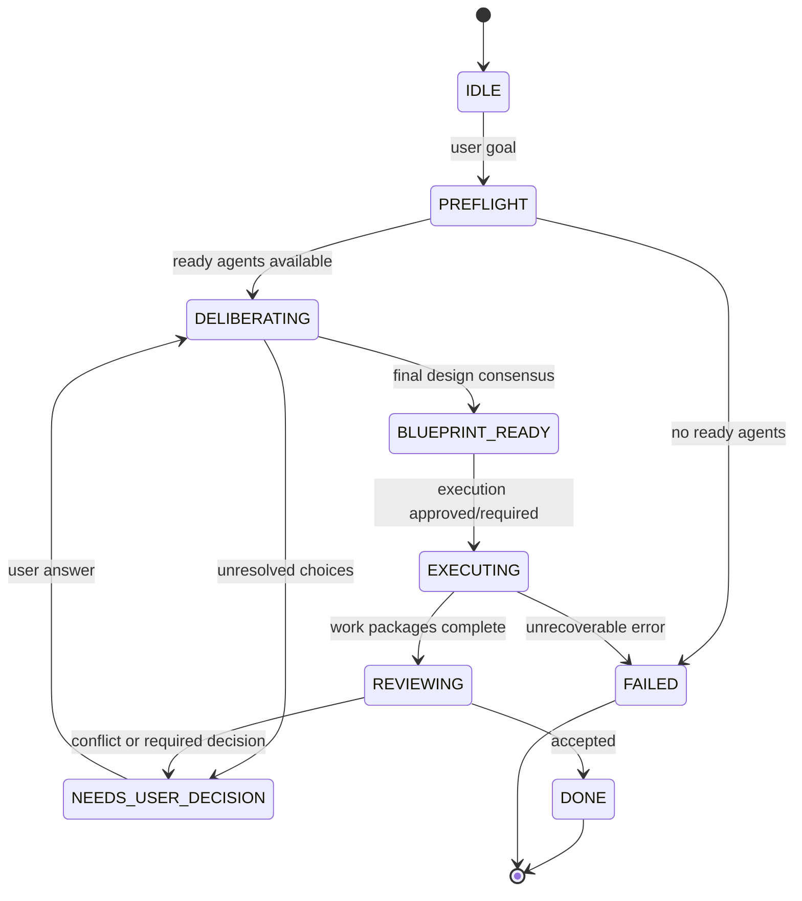

# Trinity v0.7.0 재설계 계획 — Multi-Agent Workflow Engine

작성일: 2026-06-03  
대상 버전: v0.7.0  
상태: 설계/기획 문서  
관련 문서:

- [`docs/plans/2026-06-02-phase-10-interactive-redesign.md`](2026-06-02-phase-10-interactive-redesign.md)
- [`docs/test-results/phase-10-T.md`](../test-results/phase-10-T.md)
- [`docs/checkpoint.md`](../checkpoint.md)

---

## 1. 배경

실사용 로그에서 다음 요청을 실행했다.

```text
레이어2 에 속하는 체인들 간 브릿지 경로를 빨리 찾아주는 봇을 개발하고 싶다. 설계해라
```

현재 실행 결과는 사용자가 기대한 "3개 에이전트가 설계 합의를 만들고, 필요한 의사결정을 사용자에게 묻고, 합의된 설계를 실행 단위로 쪼개 작업을 수행하는 흐름"이 아니었다.

관찰된 증상:

- Claude pane은 실제 설계 응답 대신 OAuth 로그인/인증 오류 화면에 머물렀다.
- Codex pane은 실제 응답 대신 `gpt-5.5 default`, `/model to change`, CLI 안내 배너가 캡처되었다.
- Gemini pane은 실제 응답 대신 인증 선택 화면이 캡처되었다.
- Deliberation은 5라운드를 소모했지만 모든 agent response가 invalid/empty/timed out으로 처리되었다.
- 최종 결과는 `No usable consensus after 5 rounds`였고 token usage는 `0`이었다.

이 결과는 단순 UI 출력 문제만이 아니다. Trinity의 현재 구조는 아직 "토론 프로토타입"에 가깝고, 사용자가 요구한 제품 형태는 "상태를 가진 multi-agent workflow engine"이다.

v0.7.0은 이 차이를 메우는 릴리스로 설계한다.

---

## 2. 사용자가 기대하는 동작

사용자가 명시한 목표 동작은 다음 7개 요구사항으로 정리된다.

| 번호 | 요구사항 | 핵심 의미 |
|------|----------|-----------|
| 1 | 등록된 1~3개 에이전트가 서로 합의해서 설계/기획을 수정하고 하나의 결론을 사용자에게 알림 | 설계 합의 단계가 있어야 하며, 합의 결과가 구조화되어야 함 |
| 2 | 사용자 의사결정이 필요하면 다음 채팅에서 질의응답을 반복하고, 질문이 끝나면 결론을 확정 | workflow state와 user-decision loop가 필요 |
| 3 | 확정된 큰 설계도를 에이전트 수만큼 쪼개 각 에이전트에 할당하고 작업 시작 | blueprint decomposition과 execution dispatch가 필요 |
| 4 | 각 에이전트는 할당 업무를 다시 나눠 자신의 subagent를 호출해 작업 가능 | parent agent delegation policy와 subtask reporting이 필요 |
| 5 | 실행 중 변경사항/의사결정은 공유문서에 기록하고, 에이전트들이 해당 의사결정을 처리 | shared.md가 단순 의견 저장소가 아니라 decision ledger가 되어야 함 |
| 6 | 이 과정은 loop를 사용 | 단발성 ask가 아니라 상태 기반 workflow loop가 필요 |
| 7 | 1~6 전체에서 각 세션은 주기적으로 감시되고 context 임계치에 도달하면 요약 후 새 세션에서 계속 | rotation이 deliberation 후처리가 아니라 모든 단계의 lifecycle guard가 되어야 함 |

---

## 3. 현재 구현과 요구사항 대조

| 요구사항 | 현재 구현 상태 | 부족한 점 | v0.7.0 재설계 필요성 |
|----------|----------------|-----------|----------------------|
| 에이전트 합의 | `DeliberationProtocol.run()`이 max round까지 의견을 수집하고 `ConsensusEngine.evaluate()` 호출 | 합의가 `agree/동의` 키워드 기반. 설계안을 병합/수정하는 structured synthesis 없음. 1개 에이전트인 경우도 자연스럽게 합의로 처리되지 않음 | 필요 |
| 사용자 의사결정 루프 | TUI는 사용자가 다음 prompt를 입력할 수 있음 | 이전 workflow state와 pending question을 추적하지 않음. "사용자 결정 필요" 상태가 없음 | 필요 |
| 큰 설계도 분해 | `TaskDistributor.distribute()`가 agent별 task description 생성 | 실행 계획 수준. 실제 agent execution으로 이어지지 않음. deliverable/dependency/file ownership 없음 | 필요 |
| 작업 시작/실행 | 없음. 합의 후 task list 표시만 함 | agent에게 할당 task를 전송하고 결과를 수집하는 execution protocol 없음 | 필요 |
| subagent 호출 | Trinity 관점에서는 없음 | 각 provider 내부 기능에 맡길 수는 있지만 Trinity가 subtask/result를 추적하지 않음 | 필요 |
| shared decision ledger | `shared.md`에 opinions, consensus, tasks, session history 기록 | decision, open issue, task status, file changes, execution result가 구조화되어 있지 않음 | 필요 |
| loop | deliberation round loop만 있음 | 전체 workflow loop는 없음. deliberation, user question, execution, review가 연결되지 않음 | 필요 |
| session/context rotation | `SessionRotator.rotate()`는 있음. Orchestrator가 ask 완료 후 `_check_and_rotate()` 호출 | 라운드 중간/실행 중간/다음 prompt 전에는 실제 rotation이 수행되지 않음. token usage가 0이면 동작 불가 | 필요 |
| provider readiness | 일부 completion/response validation 있음 | auth/model-loading/ready prompt를 시작 전에 gate하지 못함. 로그처럼 인증 UI를 답변으로 읽음 | 최우선 필요 |

---

## 4. v0.7.0 핵심 목표

v0.7.0의 목표는 Trinity를 다음 구조로 전환하는 것이다.

```text
Provider readiness 확인
  -> 설계 합의 loop
  -> 사용자 의사결정 loop
  -> 최종 blueprint 확정
  -> agent별 execution plan 분해
  -> agent execution loop
  -> review/merge/완료
```

v0.7.0에서 완료되어야 하는 핵심 산출물:

1. **ProviderReadinessGate**
   - 인증/모델 로딩/CLI 배너 상태를 감지하고, 준비되지 않은 provider는 deliberation에 투입하지 않는다.
   - 준비 실패 시 사용자에게 구체적인 조치 명령을 보여준다.

2. **WorkflowStateMachine**
   - 단발성 `ask()`가 아니라 상태를 가진 workflow를 도입한다.
   - 상태: `PREFLIGHT`, `DELIBERATING`, `NEEDS_USER_DECISION`, `BLUEPRINT_READY`, `EXECUTING`, `REVIEWING`, `DONE`, `FAILED`.

3. **Structured Consensus**
   - plain text 합의가 아니라 `DesignConclusion`, `OpenQuestion`, `DecisionRecord`, `Blueprint` 형태로 저장한다.

4. **User Decision Loop**
   - 에이전트가 사용자 의사결정이 필요하다고 판단하면 workflow를 멈추고 질문을 제시한다.
   - 사용자의 다음 입력은 새 작업이 아니라 pending question의 답변으로 처리된다.

5. **Execution Protocol**
   - 합의된 blueprint를 agent별 work package로 분해한다.
   - 각 package를 해당 agent에게 전송하고, agent result를 수집한다.

6. **Shared Decision Ledger**
   - shared.md에 opinions뿐 아니라 decisions, open questions, task status, execution results, file changes를 구조적으로 기록한다.

7. **Lifecycle Rotation**
   - deliberation round 전/후, user decision 처리 전/후, execution task 전/후에 context budget과 health를 검사한다.
   - threshold 도달 시 요약, shared.md 기록, 새 세션 시작, continuation prompt 주입을 보장한다.

---

## 5. 우선순위별 재설계

### P0. Provider readiness/auth gating

#### 현재 문제

현재 interactive mode는 tmux pane에서 CLI를 실행하고, 일정 시간 안에 prompt가 보이면 ready로 간주한다. 하지만 실제 로그에서는 다음 상태가 발생했다.

- Claude: OAuth URL/Invalid code 화면
- Codex: 모델 배너와 loading/default model UI
- Gemini: 인증 방식 선택 화면

이 상태에서 deliberation을 시작하면 실제 설계 응답이 아니라 UI noise가 캡처된다.

#### 설계 방향

새 컴포넌트:

```text
ProviderReadinessGate
  - check(agent) -> ReadinessResult
  - wait_until_ready(agent, timeout) -> ReadinessResult
  - classify_pane_state(lines) -> ProviderState
```

Provider state:

```text
READY
AUTH_REQUIRED
MODEL_LOADING
WORKSPACE_TRUST_REQUIRED
CLI_BANNER_ONLY
PROMPT_NOT_SENT
PROCESS_DEAD
UNKNOWN_NOT_READY
```

ReadinessResult:

```python
@dataclass
class ReadinessResult:
    agent_name: str
    provider: Provider
    ready: bool
    state: ProviderState
    reason: str
    action_hint: str
    excerpt: str = ""
```

#### Provider별 기준

| Provider | READY 조건 | 실패 조건 |
|----------|------------|-----------|
| Claude | prompt return 또는 정상 입력 대기 상태 | OAuth URL, invalid code, login required, workspace trust, no prompt |
| Codex | prompt input 가능 상태 또는 command accepted 상태 | model loading, default model banner only, auth required, install/runtime error |
| Gemini | prompt input 가능 상태 또는 marker test 성공 | auth method picker, Vertex env missing, terms/privacy screen, model loading |

#### 구현 파일 후보

- 신규: `src/trinity/providers/readiness.py`
- 수정: `src/trinity/orchestrator.py`
- 수정: `src/trinity/agents/*_agent.py`
- 수정: `src/trinity/tui/events.py`
- 수정: `src/trinity/tui/app.py`

#### 완료 기준

- 인증 대기 화면이 나오면 deliberation을 시작하지 않는다.
- TUI가 `claude: auth required`, `gemini: auth required`처럼 명확히 표시한다.
- ready agent가 0개면 workflow를 실패 상태로 종료하고, 사용자에게 로그인 명령을 제시한다.
- 일부 agent만 ready라면 설정에 따라 두 가지 모드 중 하나를 선택한다.
  - strict: 모든 active agent ready 필요
  - degraded: ready agent만 사용

#### 테스트

- Claude OAuth 화면 fixture -> `AUTH_REQUIRED`
- Gemini auth picker fixture -> `AUTH_REQUIRED`
- Codex model banner fixture -> `MODEL_LOADING` 또는 `CLI_BANNER_ONLY`
- ready 상태 fixture -> `READY`
- readiness 실패 시 `DeliberationProtocol.run()`이 호출되지 않는 orchestrator test

---

### P0. Interactive completion/response contract 강화

#### 현재 문제

응답 추출은 tmux pane text 기반이다. provider UI가 repaint되거나 prompt echo가 섞이면 실제 답변과 UI noise를 분리하기 어렵다.

#### 설계 방향

모든 interactive request에는 request boundary가 필요하다.

```text
TRINITY_REQUEST_START <request_id>
...
TRINITY_REQUEST_END <request_id>
```

하지만 provider가 boundary를 그대로 출력하지 않을 수 있으므로 다음을 조합한다.

- line boundary
- sent prompt fingerprint
- explicit marker
- prompt return
- provider-specific event/session file
- response validator

새 모델:

```python
@dataclass
class AgentResponse:
    agent_name: str
    request_id: str
    content: str
    raw_output_path: Path
    clean_output_path: Path
    status: ResponseStatus
    confidence: float
    token_usage: ContextUsage | None
    diagnostics: list[str]
```

ResponseStatus:

```text
OK
AUTH_REQUIRED
MODEL_LOADING
TIMEOUT
PROMPT_ECHO
CLI_NOISE
EMPTY
PROCESS_DEAD
INVALID
```

#### 완료 기준

- shared.md에는 `ResponseStatus.OK`만 opinion/execution result로 기록된다.
- invalid output은 `Response Diagnostics` 또는 provider raw log에만 기록된다.
- raw/clean output 파일이 request id로 저장된다.

---

### P1. Workflow state machine

#### 현재 문제

현재 TUI에서 사용자가 입력한 prompt는 매번 새 deliberation으로 처리된다. pending decision이나 기존 blueprint 상태가 없다.

#### 설계 방향

새 컴포넌트:

```text
WorkflowEngine
  - start(user_goal)
  - handle_user_input(text)
  - tick()
  - run_until_waiting_or_done()
```

상태:

```text
IDLE
PREFLIGHT
DELIBERATING
NEEDS_USER_DECISION
BLUEPRINT_READY
EXECUTING
REVIEWING
DONE
FAILED
```

상태 전이:



#### 새 데이터 모델

```python
@dataclass
class WorkflowSession:
    id: str
    goal: str
    state: WorkflowState
    active_agents: list[str]
    current_round: int
    pending_questions: list[OpenQuestion]
    blueprint: Blueprint | None
    work_packages: list[WorkPackage]
    decisions: list[DecisionRecord]
```

```python
@dataclass
class OpenQuestion:
    id: str
    question: str
    options: list[str]
    recommended_option: str | None
    blocking: bool
    raised_by: list[str]
    rationale: str
```

```python
@dataclass
class DecisionRecord:
    id: str
    question_id: str | None
    decision: str
    decided_by: Literal["user", "agents"]
    rationale: str
    timestamp: float
```

#### 완료 기준

- 사용자가 의사결정 질문에 답하면 새 goal로 처리하지 않고 pending question answer로 반영한다.
- TUI에 현재 workflow state가 표시된다.
- `/status`가 workflow state, pending questions, current package를 보여준다.

---

### P1. Structured deliberation and synthesis

#### 현재 문제

현재 consensus summary는 첫 번째 의견 일부 또는 agreement count 중심이다. 사용자가 원하는 것은 "설계/기획을 수정해 하나의 결론을 만드는 것"이다.

#### 설계 방향

Deliberation prompt를 다음 역할로 분리한다.

1. **Proposal round**
   - 각 agent가 설계안을 낸다.

2. **Critique round**
   - 각 agent가 다른 설계의 문제, 위험, 누락을 지적한다.

3. **Synthesis round**
   - 에이전트들이 수정된 단일 blueprint를 만든다.

4. **Decision extraction**
   - 사용자 결정이 필요한 항목을 추출한다.

5. **Finalization**
   - pending question이 없으면 blueprint 확정.

새 산출물:

```python
@dataclass
class Blueprint:
    title: str
    summary: str
    architecture: list[ArchitectureComponent]
    data_flow: list[str]
    external_dependencies: list[str]
    risks: list[RiskItem]
    acceptance_criteria: list[str]
    open_questions: list[OpenQuestion]
```

```python
@dataclass
class ArchitectureComponent:
    name: str
    responsibility: str
    owner_agent: str | None
    dependencies: list[str]
```

#### 합의 판단 변경

기존:

```text
agent response contains "agree" -> count as agreement
```

v0.7.0:

```text
agent emits structured vote:
  - APPROVE
  - APPROVE_WITH_CHANGES
  - BLOCKED_BY_QUESTION
  - REJECT
```

ConsensusResult는 다음을 포함해야 한다.

```python
@dataclass
class StructuredConsensusResult:
    reached: bool
    vote_count: dict[VoteType, int]
    final_blueprint: Blueprint | None
    open_questions: list[OpenQuestion]
    blockers: list[str]
```

#### 완료 기준

- 단일 agent만 active인 경우, 유효한 blueprint가 나오면 consensus reached로 처리한다.
- 2~3개 agent는 `APPROVE` 또는 `APPROVE_WITH_CHANGES`가 threshold를 넘으면 blueprint 확정.
- `BLOCKED_BY_QUESTION`이 있으면 사용자 질문 상태로 전환.

---

### P1. User decision loop

#### 현재 문제

현재는 사용자가 다음 줄에 답변해도 Trinity는 새 독립 질문으로 처리한다.

#### 설계 방향

TUI prompt handler가 workflow state를 본다.

```text
if state == NEEDS_USER_DECISION:
    handle_user_decision(input)
else:
    start_new_workflow(input)
```

사용자 질문 표시 예시:

```text
결정이 필요합니다.

Q1. 브릿지 경로 탐색 기준을 무엇으로 최적화할까요?
  1. 최저 수수료
  2. 최단 시간
  3. 실패율/안정성 우선
  4. 혼합 점수

추천: 혼합 점수
이유: L2 bridge는 수수료/속도/실패율이 모두 사용자 경험에 직접 영향.
```

사용자가 답하면:

- `DecisionRecord(decided_by="user")` 생성
- shared.md `## Decisions`에 기록
- 다음 deliberation round prompt에 decision을 포함

#### 완료 기준

- pending question이 있으면 새 workflow를 시작하지 않는다.
- `/questions` 명령으로 pending questions를 볼 수 있다.
- `/decisions` 명령으로 확정 decision ledger를 볼 수 있다.

---

### P1. Blueprint decomposition and work package generation

#### 현재 문제

TaskDistributor는 consensus text를 agent별 문장으로 바꾸는 정도다. 큰 설계도를 실제 실행 가능한 작업 단위로 쪼개지 못한다.

#### 설계 방향

새 컴포넌트:

```text
BlueprintDecomposer
  - decompose(blueprint, agents) -> list[WorkPackage]
```

WorkPackage:

```python
@dataclass
class WorkPackage:
    id: str
    title: str
    owner_agent: str
    objective: str
    scope: list[str]
    out_of_scope: list[str]
    dependencies: list[str]
    expected_files: list[str]
    acceptance_criteria: list[str]
    status: WorkStatus
```

WorkStatus:

```text
PENDING
RUNNING
WAITING_ON_DECISION
BLOCKED
DONE
FAILED
NEEDS_REVIEW
```

분배 원칙:

- active agent 수만큼 top-level package를 만든다.
- agent role/strength에 맞춘다.
- dependency가 있으면 순서를 명시한다.
- 설계-only 요청이면 execution package를 만들지 않고 blueprint만 출력한다.
- 구현 요청이면 package를 실행 단계로 넘긴다.

#### 예시: L2 bridge path bot

```text
Claude package:
  - 전체 architecture, scoring model, route search strategy, failure model

Codex package:
  - bridge adapter interface, route graph, quote aggregation, path search implementation

Gemini package:
  - edge cases, bridge provider reliability matrix, test scenarios, attack/failure analysis
```

#### 완료 기준

- 1개 agent 활성화: package 1개
- 2개 agent 활성화: package 2개
- 3개 agent 활성화: package 3개
- 각 package는 objective, scope, acceptance criteria를 가진다.

---

### P1. Execution protocol

#### 현재 문제

TaskAssignment는 생성되지만 실행되지 않는다.

#### 설계 방향

새 컴포넌트:

```text
ExecutionProtocol
  - run(work_packages)
  - dispatch_package(agent, package)
  - collect_result(agent, package)
  - review_results()
```

실행 prompt:

```text
[Work Package]
ID: WP-001
Owner: codex
Objective: ...
Scope:
- ...
Acceptance Criteria:
- ...

[Shared Decisions]
...

작업을 수행하고 결과를 다음 형식으로 보고:
## Completed
## Files Changed
## Decisions Made
## Blockers
## Follow-up
```

ExecutionResult:

```python
@dataclass
class ExecutionResult:
    package_id: str
    agent_name: str
    status: WorkStatus
    summary: str
    files_changed: list[str]
    decisions_made: list[DecisionRecord]
    blockers: list[str]
    raw_response_path: Path
```

#### 완료 기준

- 합의 후 execution intent일 때 실제 agent call이 발생한다.
- execution result가 shared.md `## Task Results`에 기록된다.
- 실패/blocked package는 workflow state에 반영된다.
- 모든 package가 done이면 review 단계로 전환한다.

---

### P2. Subagent delegation policy

#### 현재 문제

Trinity가 provider 내부 subagent를 직접 관리하지 않는다.

#### 설계 방향

Trinity는 provider별 subagent 구현을 직접 강제하지 않고, parent agent에게 delegation contract를 준다.

Parent agent prompt에 다음 정책을 포함한다.

```text
If you delegate to subagents/tools, report:
- subtask id
- subagent/tool used
- input objective
- output summary
- decisions made
- files changed
- unresolved issues
```

SubtaskResult:

```python
@dataclass
class SubtaskResult:
    id: str
    parent_package_id: str
    parent_agent: str
    delegated_to: str
    objective: str
    result_summary: str
    status: WorkStatus
```

#### 완료 기준

- Trinity가 Claude/Codex/Gemini 내부 subagent 호출을 모두 통제할 필요는 없다.
- 대신 parent agent가 subtask report를 남기도록 강제한다.
- shared.md `## Subtasks` 섹션에 결과가 기록된다.

---

### P2. Shared document redesign

#### 현재 문제

shared.md는 의견, 합의, task assignment, session history 중심이다. 실행 workflow에는 부족하다.

#### v0.7.0 shared.md 구조

```markdown
# Shared Context

## Current Goal

## Workflow State
- id:
- state:
- current_round:
- active_agents:

## Provider Readiness

## Decisions
### DEC-001
- decided_by:
- decision:
- rationale:

## Open Questions
### Q-001
- status:
- question:
- options:
- recommendation:

## Blueprint

## Work Packages
### WP-001
- owner:
- status:
- objective:
- acceptance:

## Task Results

## Subtasks

## Round Opinions

## Response Diagnostics

## Session History
```

#### 저장 방식

Markdown은 사람이 읽기 좋지만 구조화된 workflow에는 취약하다. v0.7.0은 두 저장소를 병행한다.

```text
.trinity/shared.md                      # 사람이 읽는 공유 문서
.trinity/workflow/session.json          # 구조화된 workflow state
.trinity/workflow/events.jsonl          # 상태 변화/event log
.trinity/logs/provider/<agent>/<id>.raw.txt
.trinity/logs/provider/<agent>/<id>.clean.txt
```

#### 완료 기준

- shared.md는 사람이 볼 수 있는 요약 문서다.
- source of truth는 `session.json`과 `events.jsonl`이다.
- shared.md 손상/수정이 있어도 workflow state를 복구할 수 있다.

---

### P2. Lifecycle rotation everywhere

#### 현재 문제

현재 rotation은 `orchestrator.ask()`가 끝난 뒤 `_check_and_rotate()`에서만 실행된다. 사용자가 원하는 것은 모든 단계에서 주기적으로 감시하는 것이다.

#### 설계 방향

새 컴포넌트:

```text
LifecycleGuard
  - before_agent_call(agent, context)
  - after_agent_call(agent, response)
  - before_round(round)
  - after_round(round)
  - before_work_package(package)
  - after_work_package(package)
```

각 hook은 다음을 검사한다.

- process alive
- readiness
- auth wait
- context ratio
- prompt projected ratio
- response token usage
- last output age
- repeated invalid response count

Rotation policy:

```text
if projected_ratio >= 0.60:
    rotate before sending next prompt
elif actual_ratio >= 0.60:
    summarize and rotate immediately after current response
elif auth/state broken:
    do not rotate; mark provider unavailable
```

#### 완료 기준

- round 중간에 agent context가 임계치를 넘으면 다음 prompt 전 rotation이 수행된다.
- execution package 사이에서도 rotation이 수행된다.
- rotation summary가 workflow state와 shared.md에 기록된다.
- 새 세션 첫 prompt에는 previous summary, current blueprint, open package가 포함된다.

---

### P2. Health and peer monitoring

#### 현재 문제

HealthChecker는 있지만 workflow lifecycle에 깊게 연결되어 있지 않다. "세션들이 서로를 주기적으로 감시"하는 요구에는 부족하다.

#### 설계 방향

두 레벨의 감시를 둔다.

1. **System health**
   - Trinity가 각 provider process/pane/readiness를 감시한다.

2. **Peer review**
   - agent 결과를 다른 agent가 review한다.
   - execution result는 바로 완료 처리하지 않고 review stage를 거친다.

ReviewPackage:

```python
@dataclass
class ReviewPackage:
    package_id: str
    reviewer_agent: str
    target_agent: str
    criteria: list[str]
```

#### 완료 기준

- 각 work package는 최소 1개 reviewer 검토를 받는다.
- active agent가 1개뿐이면 self-review prompt를 수행한다.
- process death는 TUI와 workflow state에 반영된다.

---

## 6. v0.7.0 구현 순서

### Milestone 0: 기준선 및 환경 안정화

목표: 현재 interactive smoke가 인증/ready 문제로 실패하는 것을 명확히 재현하고 fixture화한다.

작업:

- pasted log를 기반으로 provider UI fixture 추가
- `ResponseValidator` fixture 보강
- `tmux` smoke checklist 문서화
- WSL native repo 기준 실행 가이드 작성

완료 기준:

- fixture tests가 auth/model-loading UI를 invalid로 분류한다.
- 실제 smoke 전 preflight가 실패 이유를 보여준다.

### Milestone 1: ProviderReadinessGate

목표: 준비되지 않은 provider로 deliberation을 시작하지 않는다.

작업:

- `ProviderState`, `ReadinessResult` 모델 추가
- Claude/Codex/Gemini readiness classifier 추가
- orchestrator startup에 preflight 연결
- TUI readiness panel 추가

완료 기준:

- 인증 화면은 `AUTH_REQUIRED`
- model loading은 `MODEL_LOADING`
- ready agent만 deliberation에 포함하거나 strict mode에서 중단

### Milestone 2: WorkflowStateMachine

목표: 단발성 prompt 처리에서 상태 기반 workflow로 전환한다.

작업:

- `WorkflowSession`, `WorkflowState`, `WorkflowEngine` 추가
- TUI input routing 변경
- `.trinity/workflow/session.json` 저장
- `/workflow`, `/questions`, `/decisions` 명령 추가

완료 기준:

- pending question 상태에서 사용자 입력은 답변으로 처리된다.
- workflow state가 재시작 후에도 복구된다.

### Milestone 3: Structured deliberation

목표: 설계 결론과 사용자 질문을 구조화한다.

작업:

- `Blueprint`, `OpenQuestion`, `DecisionRecord` 모델 추가
- proposal/critique/synthesis prompt 도입
- keyword consensus를 structured vote 기반으로 대체 또는 보완
- 1-agent/2-agent/3-agent 합의 규칙 정의

완료 기준:

- 설계 요청 결과가 `Blueprint`로 저장된다.
- user decision이 필요한 경우 `NEEDS_USER_DECISION`으로 전환된다.

### Milestone 4: Blueprint decomposition

목표: 확정 blueprint를 agent 수만큼 work package로 나눈다.

작업:

- `BlueprintDecomposer`
- `WorkPackage`
- dependency/order 계산
- shared.md `Work Packages` 렌더링

완료 기준:

- active agent 수와 top-level package 수가 일치한다.
- 각 package에 acceptance criteria가 있다.

### Milestone 5: ExecutionProtocol

목표: task list 표시가 아니라 실제 실행을 시작한다.

작업:

- `ExecutionProtocol`
- package dispatch/collect
- execution result validation
- task status update
- review stage 진입

완료 기준:

- execution intent에서 agent call이 발생한다.
- 결과가 `Task Results`에 기록된다.
- 실패/blocked 상태가 workflow에 남는다.

### Milestone 6: LifecycleGuard and rotation

목표: 모든 단계에서 context/health/readiness를 감시한다.

작업:

- `LifecycleGuard`
- before/after hook 추가
- pre-send rotation
- post-response rotation
- execution package rotation
- continuation prompt 개선

완료 기준:

- projected context가 threshold를 넘으면 다음 prompt 전 rotation.
- rotation 후에도 현재 workflow/package를 이어서 수행.

### Milestone 7: Subagent report contract

목표: provider 내부 delegation을 Trinity가 추적 가능한 결과로 수집한다.

작업:

- subtask report prompt 추가
- `SubtaskResult` parser/renderer
- shared.md `Subtasks` 섹션 추가

완료 기준:

- parent agent가 subagent/tool 사용 내용을 보고한다.
- subtask 결과가 task result와 연결된다.

---

## 7. v0.7.0 설정 변경안

### 새 config 예시

```toml
[workflow]
mode = "guided"                  # guided | autonomous
strict_provider_readiness = true
allow_degraded_agent_set = false
persist_state = true
state_file = ".trinity/workflow/session.json"
events_file = ".trinity/workflow/events.jsonl"

[workflow.decisions]
ask_user_for_blocking_questions = true
allow_agent_local_decisions = true
record_agent_decisions = true

[workflow.execution]
enabled = true
require_user_approval_before_execution = true
review_after_execution = true
max_execution_loops = 10

[workflow.rotation]
check_before_agent_call = true
check_after_agent_call = true
check_before_work_package = true
threshold = 0.60
warning_threshold = 0.55

[providers]
readiness_timeout_seconds = 45
startup_auth_timeout_seconds = 15
```

### 호환성

- 기존 config에는 `[workflow]`가 없으므로 기본값을 적용한다.
- `trinity ask`는 기존 one-shot 동작을 유지하되, `--workflow` 또는 TUI 기본 모드에서 workflow engine을 사용한다.
- v0.7.0 전환 시 interactive TUI는 workflow mode를 기본으로 쓸 수 있다.

---

## 8. TUI/UX 변경안

### 시작 화면

```text
Trinity v0.7.0

Workflow: IDLE
Providers:
  claude  READY          opus[1m]
  codex   READY          gpt-5.4-mini
  gemini  AUTH_REQUIRED  Run: gemini auth/login ...
```

### 진행 화면

```text
Workflow: DELIBERATING
Round: 2 / 5
State: synthesis

Open Questions: 0
Blueprint: drafting
Ready Agents: claude, codex
Unavailable: gemini(auth required)
```

### 사용자 결정 화면

```text
Workflow: NEEDS_USER_DECISION

Q1. 브릿지 경로 최적화 기준을 선택하세요.
1. 최저 수수료
2. 최단 시간
3. 안정성 우선
4. 혼합 점수

추천: 4
```

### 실행 화면

```text
Workflow: EXECUTING

WP-001 claude  DONE
WP-002 codex   RUNNING
WP-003 gemini  WAITING_ON_DECISION
```

---

## 9. 테스트 전략

### Unit tests

- `tests/test_provider_readiness.py`
- `tests/test_workflow_state.py`
- `tests/test_structured_consensus.py`
- `tests/test_blueprint_decomposer.py`
- `tests/test_execution_protocol.py`
- `tests/test_lifecycle_guard.py`
- `tests/test_shared_ledger.py`

### Integration tests

- one active agent workflow
- two active agents workflow
- three active agents workflow
- pending user question flow
- execution package dispatch flow
- rotation before next prompt
- invalid provider excluded from ready set

### Smoke tests

WSL/tmux 환경에서 실행:

```bash
cd ~/workspace/Trinity
uv run trinity
```

필수 smoke:

1. Claude/Codex/Gemini 모두 인증 완료 상태에서 설계 요청.
2. Gemini만 auth required 상태에서 strict mode 중단 확인.
3. degraded mode에서 ready agent만으로 workflow 진행 확인.
4. 사용자 의사결정 질문 생성/답변/재개 확인.
5. execution package 하나 이상 실제 dispatch 확인.

---

## 10. v0.7.0 완료 기준

v0.7.0은 다음 조건을 모두 만족해야 완료로 본다.

### Provider

- 인증/모델 로딩/CLI 배너 상태는 답변으로 기록되지 않는다.
- provider readiness 실패 이유와 사용자 조치가 명확히 표시된다.
- ready agent가 없으면 workflow를 시작하지 않는다.

### Deliberation

- 1~3개 active agent 모두 지원한다.
- 설계 결과는 구조화된 blueprint로 저장된다.
- 합의 실패와 사용자 질문 필요 상태가 구분된다.

### User loop

- pending question이 있으면 다음 입력은 질문 답변으로 처리된다.
- 사용자 결정은 shared.md와 workflow state에 기록된다.

### Execution

- blueprint가 active agent 수만큼 work package로 분해된다.
- execution intent에서는 실제 agent call이 발생한다.
- package status와 results가 기록된다.

### Rotation

- context threshold는 deliberation/execution 전체에서 감시된다.
- threshold 초과 전후로 summary/continuation이 동작한다.
- token usage가 0으로 고정되지 않는다.

### Documentation

- v0.7.0 workflow user guide 작성
- troubleshooting guide에 provider auth/readiness 문제 추가
- test result 문서 작성

---

## 11. 릴리스 범위와 제외 범위

### v0.7.0에 포함

- Provider readiness gate
- Workflow state machine
- Structured blueprint
- User decision loop
- Work package decomposition
- Execution protocol MVP
- Lifecycle guard MVP
- Shared ledger schema

### v0.7.x 후속으로 미룰 수 있는 것

- 완전한 provider별 event stream integration
- provider 내부 subagent의 완전 자동 추적
- multi-worktree merge 자동화
- PR 생성/리뷰/merge 자동 pipeline
- 장기 persistent memory와 프로젝트별 knowledge base

---

## 12. 현재 로그 기반 즉시 조치

v0.7.0 개발 전에도 실제 smoke를 위해 다음은 먼저 정리해야 한다.

### Claude

문제:

- OAuth URL과 Invalid code 화면이 pane에 남아 있음.

조치:

```bash
claude auth
claude doctor
claude --version
```

또는 Claude Code interactive에서 완전히 로그인 후 `claude` 실행 시 바로 prompt가 뜨는지 확인.

### Codex

문제:

- model banner/default UI가 응답으로 캡처됨.

조치:

```bash
source ~/.nvm/nvm.sh
codex doctor
codex login
codex --version
```

Codex CLI가 WSL 내부 경로인지 확인:

```bash
which codex
```

### Gemini

문제:

- auth picker/Vertex AI env missing 화면이 캡처됨.

조치:

```bash
source ~/.nvm/nvm.sh
gemini --version
gemini
```

Gemini CLI 인증 방식을 완료하고, 시작 시 auth picker가 더 이상 뜨지 않아야 한다.

---

## 13. 권장 작업 브랜치 순서

1. `codex/v070-provider-readiness`
2. `codex/v070-workflow-state`
3. `codex/v070-structured-consensus`
4. `codex/v070-blueprint-decomposition`
5. `codex/v070-execution-protocol`
6. `codex/v070-lifecycle-guard`
7. `codex/v070-shared-ledger-docs`

각 브랜치는 작업 단위별 커밋 후 마지막에 한 번만 push한다.

---

## 14. 요약

현재 Trinity는 다음 기능을 갖고 있다.

- 다중 agent round loop
- shared.md opinion 기록
- 간단한 keyword consensus
- task assignment plan 생성
- response validation 일부
- session rotation primitive

하지만 사용자가 원하는 v0.7.0 수준에는 다음이 부족하다.

- provider readiness gate
- workflow state
- user decision loop
- structured blueprint
- 실제 execution protocol
- subtask reporting
- execution 중 lifecycle rotation
- persistent workflow state

따라서 v0.7.0은 "interactive provider reliability"를 넘어, Trinity를 "multi-agent workflow engine"으로 재설계하는 릴리스로 정의한다.

