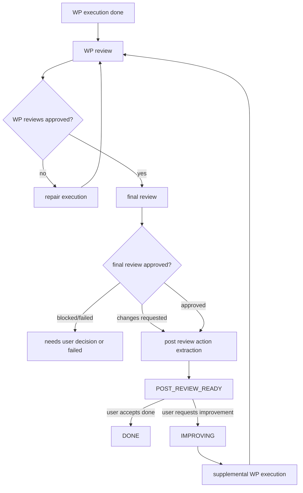

# Post Review Follow-up Workflow Design

작성일: 2026-06-08

브랜치: `codex/review-workflow-design`

상태: 기능 설계 초안

관련 문서:

- [Review Workflow Design](2026-06-08-review-workflow-design.md)
- [Execute Retry and WP Detail](2026-06-08-execute-retry-and-wp-detail.md)
- [Trinity Slash Command Routing Design](2026-06-06-trinity-slash-command-routing-design.md)

## 목적

WP 실행과 final review가 끝난 뒤에도 사용자가 같은 세션 안에서 리뷰 기반 보강 요청을 할 수 있게 한다.

현재 리뷰 워크플로우는 다음을 해결한다.

1. WP 구현이 끝나면 review package를 실행한다.
2. WP 리뷰가 수정 요청을 내면 해당 WP executor가 repair를 수행한다.
3. 모든 WP가 통과하면 final review를 수행한다.
4. final review가 승인되면 workflow가 `DONE`이 된다.

하지만 사용자는 final review 이후에도 자연스럽게 다음 요청을 할 수 있다.

- "final review에서 말한 테스트 보강을 해라"
- "리뷰에 나온 성능 우려만 반영해라"
- "추가 기능으로 난이도 설정을 넣어라"
- "central agent가 보기에 더 필요한 것만 골라서 진행해라"

이 문서는 위 요청을 새 workflow가 아니라 현재 session의 후속 보강 workflow로 처리하는 설계를 정의한다.

## 현재 동작 분석

### 현재 상태 전이

[src/trinity/workflow/engine.py](/home/user/workspace/Trinity/src/trinity/workflow/engine.py)의
`_finalize_review_state()` 기준으로 final review가 승인되면 상태는 `DONE`이 된다.

```text
EXECUTING -> REVIEWING -> DONE
```

### Nexus follow-up 라우팅

Textual Nexus 입력은 다음 경로로 들어간다.

```text
NexusScreen.FollowUpSubmitted
-> TextualWorkflowController.submit_follow_up()
-> WorkflowEngine.handle_user_input()
```

`WorkflowEngine._can_continue_existing_blueprint()`는 `DONE` 상태도 기존 blueprint follow-up 대상으로 본다.

```python
return self.session.blueprint is not None and self.session.state in {
    WorkflowState.BLUEPRINT_READY,
    WorkflowState.REVIEWING,
    WorkflowState.DONE,
    WorkflowState.FAILED,
}
```

따라서 final review 이후 사용자가 Nexus에 일반 문장을 입력하면 새 workflow가 아니라 기존 workflow를 이어서
`continue_from_blueprint()`가 실행된다.

### 현재 한계

현재 `continue_from_blueprint()`가 만드는 prompt에는 다음이 포함된다.

- original goal
- current approved blueprint
- user follow-up instruction
- recorded decisions

하지만 다음은 자동으로 포함되지 않는다.

- WP review 결과
- final review 결과
- final review의 compatibility notes
- 실행 결과와 리뷰 결과의 연결
- central agent가 추출한 보강 후보

또한 `enable_execution_for_current_blueprint()`는 current blueprint를 다시 executable로 만들면서 다음을 초기화한다.

```python
self.session.execution_results = []
self.session.subtask_results = []
self.session.review_packages = []
self.session.review_results = []
```

즉 final review 이후 보강 작업을 그냥 기존 execution flow에 태우면 과거 실행/리뷰 증거가 사라질 수 있다.
후속 보강 기능은 기존 증거를 보존하면서 새 보강 WP만 추가해야 한다.

## 설계 목표

1. final review 이후 사용자의 리뷰 기반 요청을 현재 session 안에 유지한다.
2. central agent가 review 결과와 사용자 요청을 함께 보고 ActionItem을 정리한다.
3. 사용자는 ActionItem을 선택하거나 자유 입력으로 새 보강 요청을 추가할 수 있다.
4. 선택된 항목만 supplemental WP로 변환한다.
5. 기존 WP, execution result, review result는 보존한다.
6. supplemental WP는 기존 execute/review 루프를 재사용한다.
7. 보강이 끝나면 final review를 다시 실행해서 최종 상태를 갱신한다.
8. Textual UI와 plain TUI 모두 같은 command registry와 workflow state를 사용한다.

## 용어

| 용어 | 의미 |
| :--- | :--- |
| Final Review | 전체 프로젝트 관점에서 실행 완료 후 수행하는 리뷰 |
| Post Review | final review 이후 사용자가 추가 요청을 남길 수 있는 단계 |
| ActionItem | review 결과나 사용자 요청에서 추출된 후속 작업 후보 |
| Supplemental WP | 기존 workflow에 추가되는 보강 work package |
| Follow-up Request | 사용자가 Nexus에서 남긴 추가 요청 |

## 상태 모델

### 새 상태 추가

`WorkflowState`에 다음 상태를 추가한다.

```python
POST_REVIEW_READY = "post_review_ready"
IMPROVING = "improving"
```

### 상태 의미

| 상태 | 의미 |
| :--- | :--- |
| `DONE` | 더 이상 필요한 작업이 없고 workflow가 종결됨 |
| `POST_REVIEW_READY` | final review가 끝났고 사용자가 보강 여부를 결정할 수 있음 |
| `IMPROVING` | 보강 ActionItem을 WP로 변환하거나 보강 WP 실행 중 |

### 상태 전이



### 왜 `DONE` 직행이 아니라 `POST_REVIEW_READY`인가

final review가 승인되어도 리뷰어가 optional follow-up을 제안할 수 있다. 사용자는 여기서 다음 중 하나를 고른다.

- 그대로 종료
- 리뷰 권장 사항 중 일부 반영
- 사용자가 직접 추가 요청
- central agent에게 우선순위 재정리 요청

따라서 final review 승인 직후를 완전한 종료로 보지 않고, UX상 "종료 가능하지만 보강 요청도 가능한 상태"로 둔다.

## 데이터 모델

### PostReviewActionItem

새 dataclass를 추가한다.

```python
class PostReviewActionStatus(str, Enum):
    PROPOSED = "proposed"
    ACCEPTED = "accepted"
    IGNORED = "ignored"
    QUEUED = "queued"
    DONE = "done"


@dataclass
class PostReviewActionItem:
    id: str
    source: str  # wp_review | final_review | user_request | central_agent
    kind: str  # bugfix | enhancement | polish | docs | test | validation | refactor
    severity: str  # critical | high | medium | low
    title: str
    summary: str
    rationale: str = ""
    related_wp_ids: list[str] = field(default_factory=list)
    related_review_ids: list[str] = field(default_factory=list)
    suggested_owner: str = ""
    requires_execution: bool = True
    status: PostReviewActionStatus = PostReviewActionStatus.PROPOSED
    created_at: float = field(default_factory=time.time)
    updated_at: float = field(default_factory=time.time)
```

### WorkflowSession 확장

`WorkflowSession`에 다음 필드를 추가한다.

```python
post_review_items: list[dict[str, Any]] = field(default_factory=list)
follow_up_requests: list[dict[str, Any]] = field(default_factory=list)
supplemental_round: int = 0
```

`follow_up_requests`는 사용자의 자유 입력을 보존한다.

```python
{
    "id": "fur-001",
    "text": "final review에서 말한 테스트 보강을 해라",
    "source_state": "post_review_ready",
    "created_at": 1780900000.0,
    "accepted_action_item_ids": ["AI-001"],
}
```

### WorkPackage 확장

Supplemental WP를 기존 WP와 구분하기 위해 `WorkPackage`에 최소 필드를 추가한다.

```python
origin: str = "initial"  # initial | review_repair | post_review_followup
origin_action_item_ids: list[str] = field(default_factory=list)
parent_package_ids: list[str] = field(default_factory=list)
supplemental_round: int = 0
```

기존 모델 변경을 줄이고 싶다면 첫 구현에서는 `metadata: dict[str, Any]`만 추가해도 된다. 다만 UI와 테스트 안정성을 위해
명시 필드를 권장한다.

## Central Agent 역할

### Post Review Synthesizer

final review가 끝난 뒤 central agent는 다음 입력을 읽고 ActionItem을 만든다.

- original goal
- current blueprint
- work packages
- execution results
- WP review results
- final review result
- previous decisions
- target workspace

이 작업은 provider write 권한이 필요 없다. 따라서 `InvocationAccess.READ_ONLY`로 실행한다.

### 출력 계약

central agent는 다음 구조를 반환한다.

```text
POST REVIEW SUMMARY:
...

ACTION ITEMS:
- id: AI-001
  source: final_review
  kind: test
  severity: high
  title: Add regression tests for execution retry
  summary: ...
  related_wp_ids: [WP-003]
  related_review_ids: [RP-FINAL-codex]
  suggested_owner: codex
  requires_execution: true

RECOMMENDED NEXT ACTION:
apply critical
```

가능하면 JSON 또는 fenced YAML을 우선 파싱하고, 실패 시 bullet parser fallback을 둔다.

## 사용자 UX

### Nexus Central Agent 영역

`POST_REVIEW_READY` 상태에서는 central agent 영역에 다음을 보여준다.

```text
Central Agent
State: post_review_ready

Final review is complete.

Suggested follow-up work:
1. [high][test] 실행 재시도 회귀 테스트 추가
2. [medium][docs] 실행 방법 문서 보강
3. [low][enhancement] 난이도 설정 추가

Actions:
[Apply critical/high] [Select items] [Ask agents] [Done]
```

### 사용자의 일반 입력

`POST_REVIEW_READY`에서 사용자가 Nexus composer에 일반 문장을 입력하면 새 세션을 시작하지 않는다.

```text
final review에서 말한 테스트 보강만 해라
```

라우팅:

```text
submit_follow_up()
-> WorkflowEngine.handle_user_input()
-> handle_post_review_input()
-> central post review planner
-> accepted ActionItem selection
-> supplemental WP 생성 또는 추가 질문 생성
```

### 빠른 선택 UI

`POST_REVIEW_READY` 상태의 기본 동작은 사용자가 리뷰 결과를 읽은 뒤 바로 후속 작업을 선택하는 것이다.

권장 버튼:

```text
[Apply critical/high] [Select items] [Ask agents] [Done]
```

- `Apply critical/high`: `severity in {critical, high}` 이고 `requires_execution=true` 인 항목을 보강 WP로 만든다.
- `Select items`: action item 목록 옆에 체크박스를 표시하고 선택된 항목만 보강 WP로 만든다.
- `Ask agents`: 리뷰 결과를 기반으로 추가 의견 수렴 라운드를 시작한다.
- `Done`: 사용자가 현재 결과를 승인하고 세션을 `DONE`으로 닫는다.

### 보강 요청 입력 예시

```text
/improve high
/improve AI-001 AI-004
/improve done

final review에서 테스트 부족하다고 한 부분만 먼저 보강해라.
```

`POST_REVIEW_READY` 상태에서 위 입력은 새 goal이 아니라 현재 세션의 후속 요청으로 저장한다.

### 질문이 필요한 경우

Central Agent가 사용자 결정 없이는 보강 WP를 만들 수 없다고 판단하면 기존 `questions for you` UI를 재사용한다.

예시:

```text
Questions for you
1. 리뷰에서 제안한 성능 개선을 지금 적용할까요?
[지금 적용] [문서만 남김] [무시]
```

이 질문의 decision은 기존 workflow decision log에 저장하되, `source="post_review_followup"` 메타데이터를 붙인다.

## WorkflowEngine 설계

### 진입 조건

Final review가 완료된 직후에는 즉시 `DONE`으로 닫지 않고 `POST_REVIEW_READY`로 전환한다.

권장 변경:

```text
_finalize_review_state()
- final review approved
  -> review action item 추출
  -> action item이 없으면 POST_REVIEW_READY 또는 DONE 중 정책 적용
  -> action item이 있으면 POST_REVIEW_READY
```

기본 정책은 `POST_REVIEW_READY`이다. 리뷰가 승인됐더라도 사용자가 보강 요청을 남길 수 있는 시간이 필요하기 때문이다.

사용자가 명시적으로 완료하면 `DONE`으로 바꾼다.

```text
/improve done
Done button
```

### 상태 라우팅

`handle_user_input()`의 라우팅 순서를 명확히 분리한다.

```text
handle_user_input(text)
1. if state == POST_REVIEW_READY:
     return handle_post_review_input(text)
2. if state == NEEDS_USER_DECISION:
     return apply_decision_or_continue(text)
3. if _can_continue_existing_blueprint():
     return continue_from_blueprint(text)
4. else:
     return start_new_workflow(text)
```

중요한 점은 `POST_REVIEW_READY`가 `_can_continue_existing_blueprint()`보다 먼저 처리되어야 한다는 것이다. 그렇지 않으면 리뷰 후 보강 요청이 일반 blueprint continuation으로 흘러가 리뷰 문맥을 잃는다.

### 새 메서드

```python
finalize_post_review(workflow_id: str) -> None
extract_post_review_items(session: WorkflowSession) -> list[PostReviewActionItem]
handle_post_review_input(user_text: str) -> WorkflowEvent
accept_post_review_items(item_ids: list[str], note: str | None = None) -> WorkflowEvent
queue_supplemental_work_packages(items: list[PostReviewActionItem]) -> list[WorkPackage]
```

역할:

- `finalize_post_review`: final review 결과를 action item으로 정규화하고 세션 상태를 `POST_REVIEW_READY`로 바꾼다.
- `extract_post_review_items`: final review, WP review, execution issue를 하나의 action item 목록으로 합친다.
- `handle_post_review_input`: `/improve`, 일반 문장, `done` 입력을 해석한다.
- `accept_post_review_items`: 사용자가 선택한 action item을 `accepted` 상태로 바꾼다.
- `queue_supplemental_work_packages`: accepted action item을 실제 실행 가능한 WP로 변환한다.

### 세션 보존 원칙

보강 실행은 새 세션을 만들지 않는다. 기존 세션에 append한다.

보존해야 하는 데이터:

- `workflow_id`
- `goal`
- `blueprint`
- `work_packages`
- `execution_results`
- `subtask_results`
- `review_packages`
- `review_results`
- `decisions`
- `messages`

초기 실행에서 사용한 증거를 삭제하면 final review 이후 사용자가 무엇을 보강하는지 추적할 수 없다. 따라서 기존 `enable_execution_for_current_blueprint()`처럼 실행 관련 필드를 clear하는 경로를 post-review 보강에 그대로 쓰면 안 된다.

### 보강 실행 생성

보강 실행은 기존 `execution_run`과 구분한다.

권장 필드:

```python
execution_run = {
    "kind": "supplemental",
    "source": "post_review_followup",
    "round": next_supplemental_round,
    "package_ids": ["WP-S001", "WP-S002"],
    "action_item_ids": ["AI-001", "AI-004"],
}
```

상태 전환:

```text
POST_REVIEW_READY
-> accepted action items
-> create supplemental WPs
-> state = EXECUTING
-> WP execution
-> WP review
-> repair if needed
-> final review
-> POST_REVIEW_READY or DONE
```

## Supplemental WP 생성

### ID 규칙

기존 WP와 충돌하지 않도록 보강 WP는 별도 prefix를 쓴다.

```text
WP-S001
WP-S002
WP-S003
```

여러 번 보강이 일어나도 ID는 단조 증가한다.

```text
first supplement:  WP-S001, WP-S002
second supplement: WP-S003
```

### WP 내용

Action item을 WP로 만들 때 다음 정보를 포함한다.

```python
WorkPackage(
    id="WP-S001",
    title="Add execution retry regression tests",
    description="Final review found that retry behavior is untested.",
    owner_agent="codex",
    dependencies=["WP-003"],
    parent_wp_id="WP-003",
    source="post_review_followup",
    source_action_item_ids=["AI-001"],
)
```

### 담당 에이전트 선택

우선순위:

1. action item의 `suggested_owner`
2. 관련 WP를 마지막으로 작업한 agent
3. 관련 WP의 `owner_agent`
4. 현재 enabled agent 중 round-robin

리뷰에서 특정 구현자가 수정해야 한다고 판단한 경우, 그 구현자가 이어서 작업하는 UX가 자연스럽다.

### 의존성

- 테스트 보강은 관련 구현 WP를 `dependencies`로 둔다.
- 문서 보강은 관련 구현 WP가 있으면 `parent_wp_id`만 기록하고 실행 순서 의존성은 두지 않는다.
- 위험도가 높은 수정은 final review 전 반드시 WP review를 다시 받는다.

## Prompt 설계

### Central post-review planner prompt

포함해야 할 문맥:

- original goal
- approved blueprint
- final review summary
- final review findings
- WP review findings
- execution failures 또는 retry 기록
- existing action items
- user follow-up request
- recorded decisions

출력 요구:

```text
Return JSON with:
- intent: done | apply_items | ask_clarification | run_agent_round
- accepted_action_item_ids
- new_action_items
- questions
- rationale
```

Fallback:

- JSON 파싱 실패 시 action item ID와 severity keyword를 heuristic으로 추출한다.
- 모델 호출 timeout 시 사용자가 입력한 텍스트를 note로 저장하고 `ASK_CLARIFICATION` 또는 `apply high` 기본값을 사용한다.

### Supplemental WP execution prompt

포함해야 할 문맥:

- 기존 구현 요약
- 관련 WP 산출물
- 관련 review finding
- accepted action item
- target workspace
- 이미 통과한 final review의 결정 사항

필수 지시:

```text
Preserve the existing implementation unless the accepted action item requires a change.
Do not restart the project from scratch.
Focus only on the supplemental work package.
```

### Final review 재진입 prompt

보강 실행 후 final reviewer에게 다음을 알려야 한다.

- 이번 리뷰는 전체 초기 구현과 보강 변경을 함께 확인한다.
- 이전 final review에서 승인된 부분은 유지됐는지 확인한다.
- accepted action item이 실제로 해결됐는지 확인한다.
- 새로 생긴 호환성 또는 실행 문제가 있는지 확인한다.

## Review 재진입

보강 WP도 일반 WP와 동일하게 리뷰를 받는다.

```text
WP-S001 executed
-> WP-S001 reviewed
-> if review failed: same owner repairs
-> if review passed: mark action item addressed
```

모든 보강 WP가 완료되면 final review를 다시 실행한다.

Final review 결과:

```text
approved and no new action items -> POST_REVIEW_READY with empty suggestions
approved with optional suggestions -> POST_REVIEW_READY
rejected or critical issue -> POST_REVIEW_READY with critical items, or EXECUTING if auto-repair policy enabled
```

자동으로 무한 보강 루프에 들어가면 안 된다. final review 이후 추가 실행은 항상 사용자 선택 또는 명시 정책으로 시작한다.

## Textual UI 설계

### Snapshot 필드

`WorkflowSnapshot`에 다음을 추가한다.

```python
post_review_items: list[PostReviewActionItem]
follow_up_requests: list[FollowUpRequest]
supplemental_round: int
post_review_mode: Literal["ready", "selecting", "executing", "done"]
```

### Central Agent 렌더링

`POST_REVIEW_READY`에서 central panel은 스크롤 가능해야 한다.

섹션:

```text
Final Review
- verdict
- reviewer
- summary

Suggested Follow-up Work
- action item cards or rows

Actions
[Apply high] [Select items]
[Ask agents] [Done]
```

버튼은 2열 grid로 배치한다. action item이 길어질 수 있으므로 central 영역은 세로 스크롤을 허용한다.

### Inspector

Inspector에는 `Post Review` 섹션을 추가한다.

```text
Post Review
- AI-001 [high][pending] Add retry tests
- AI-002 [medium][accepted] Update docs

Follow-up Requests
- [17:21] /improve high
```

기존 `Workflow`, `Questions`, `Decisions`, `Packages`, `Execution Log`와 같이 현재 세션 기준으로만 보여야 한다.

### Command palette

`/improve`는 palette에서 현재 상태에 따라 설명을 다르게 보여준다.

```text
/improve      review follow-up or supplemental work
```

한국어 locale일 때:

```text
/improve      리뷰 후속 보강 작업 선택 또는 요청
```

테마 이름, agent 이름, branch 이름은 번역하지 않는다.

## Plain TUI 설계

Plain TUI에서도 같은 기능을 쓸 수 있어야 한다.

명령어:

```text
/improve
/improve high
/improve critical
/improve AI-001 AI-004
/improve done
```

동작:

- 인자가 없으면 action item 목록과 사용법을 출력한다.
- severity 인자는 해당 severity 이상 또는 정확한 severity 정책을 명시한다. 권장은 정확한 severity match이다.
- ID 인자는 해당 action item을 accepted로 바꾸고 보강 WP를 생성한다.
- `done`은 세션을 `DONE`으로 닫는다.

`/workflow`에는 다음 요약을 추가한다.

```text
Post review: ready
Pending action items: 3
Supplemental rounds: 1
```

## Slash Command Registry

새 command spec:

```python
SlashCommandSpec(
    name="/improve",
    summary="review follow-up or supplemental work",
    usage="/improve [all|critical|high|AI-ID...|done|text]",
    category=SlashCommandCategory.EXECUTION,
    requires_workflow=True,
    agent_call="conditional",
)
```

라우팅 규칙:

- `/improve done`: local state transition만 수행한다.
- `/improve AI-001`: local selection 후 supplemental WP 생성.
- `/improve high`: local selection 후 supplemental WP 생성.
- `/improve some free text`: Central post-review planner 호출.

`/review`와의 차이:

- `/review`: 리뷰를 새로 실행하거나 리뷰 상태를 확인한다.
- `/improve`: 리뷰 결과를 기반으로 보강 작업을 시작한다.

## 테스트 계획

### WorkflowEngine

필수 테스트:

1. final review approved 후 세션이 `POST_REVIEW_READY`가 된다.
2. `POST_REVIEW_READY`에서 `/improve done`을 입력하면 `DONE`이 된다.
3. `POST_REVIEW_READY`에서 일반 문장을 입력해도 새 workflow가 시작되지 않는다.
4. Central planner prompt에 final review와 WP review 문맥이 포함된다.
5. action item 선택 시 기존 `execution_results`, `subtask_results`, `review_results`가 보존된다.
6. supplemental WP ID가 기존 WP와 충돌하지 않는다.
7. supplemental WP 완료 후 WP review와 final review가 다시 실행된다.
8. retry/resume 세션에서도 post-review action item이 같은 `workflow_id`에 매핑된다.

### Parser

- JSON output parsing
- fenced YAML parsing
- bullet fallback parsing
- severity normalization
- related WP ID extraction

### TextualWorkflowController

- `/improve` 입력이 `WorkflowEngine.handle_post_review_input()`으로 전달된다.
- 버튼 선택이 action item ID 목록으로 변환된다.
- snapshot에 `post_review_items`가 포함된다.
- resume 직후에도 post-review 영역이 표시된다.

### Textual UI

- central panel scroll 동작
- 2열 action button grid
- checkbox 선택 모드
- command palette 한국어 설명
- inspector post review wrapping

### Plain TUI

- `/improve` help 출력
- `/improve high` 실행
- `/improve AI-001 AI-004` 실행
- `/improve done` 완료

## 구현 단계

1. 모델과 상태 추가
   - `WorkflowState.POST_REVIEW_READY`
   - `PostReviewActionItem`
   - snapshot 필드

2. 리뷰 결과 정규화
   - final review와 WP review에서 action item 추출
   - parser fallback 추가

3. WorkflowEngine 라우팅
   - `_finalize_review_state()` 수정
   - `handle_post_review_input()` 추가
   - supplemental WP 생성

4. Textual UI
   - central panel post-review 렌더링
   - 2열 버튼과 체크박스 선택 모드
   - inspector post review 섹션

5. Slash command와 plain TUI
   - `/improve` 등록
   - command palette locale description
   - plain TUI command handler

6. 리뷰 재진입
   - supplemental WP 실행 완료 후 WP review 연결
   - final review 재실행
   - action item status 갱신

## 리스크와 결정 사항

### Evidence 삭제 위험

보강 작업을 시작할 때 기존 실행 결과를 clear하면 리뷰 후속 작업의 근거가 사라진다. post-review 보강은 반드시 append-only 방식으로 설계한다.

### Action item 과다 생성

리뷰어가 선택적 제안까지 모두 action item으로 만들면 UX가 무거워진다. 기본 노출은 `critical`, `high`, `requires_execution=true`를 우선한다.

### DONE 의미 약화

final review 승인 직후 `DONE`으로 닫지 않으면 사용자는 완료 여부를 헷갈릴 수 있다. UI 문구는 `Final review complete`와 `Session still open for follow-up`을 분리해서 보여준다.

### 자동 보강 루프

리뷰 후 자동 보강은 위험하다. 사용자의 명시 선택 없이 새 WP를 실행하지 않는다.

## 권장 결정

- 명령어 이름은 `/improve`를 사용한다.
- final review 완료 후 기본 상태는 `POST_REVIEW_READY`로 둔다.
- 사용자가 `Done` 또는 `/improve done`을 선택해야 세션이 `DONE`이 된다.
- 후속 요청은 새 workflow가 아니라 기존 `workflow_id`에 append한다.
- 보강 WP ID는 `WP-S001` 형식을 사용한다.
- 보강 WP도 WP review와 final review를 다시 통과해야 한다.
- Central Agent는 리뷰 결과를 정리하고 선택지를 제안하되, 실행 시작은 사용자 선택 이후에만 한다.
