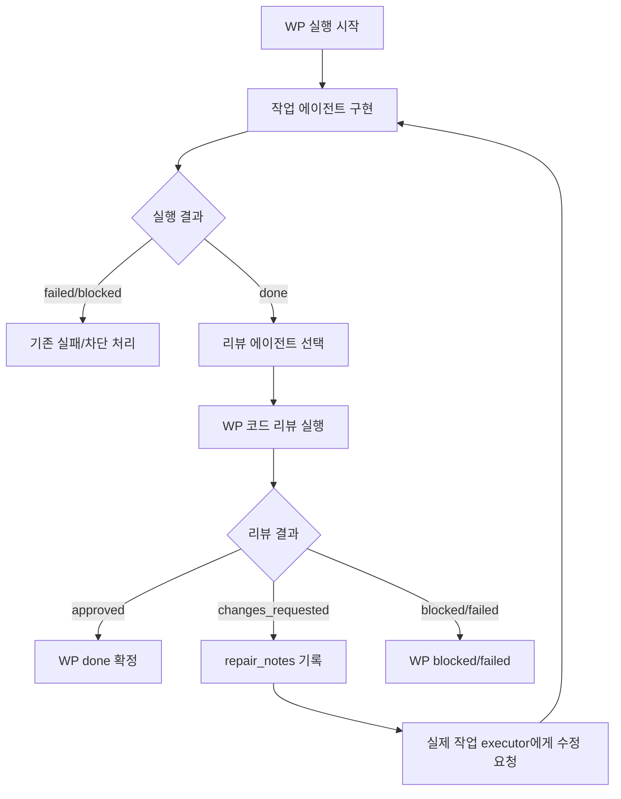
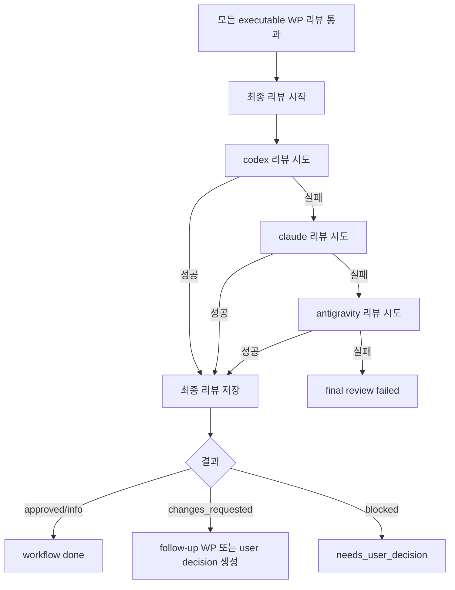

# Review Workflow Design

작성일: 2026-06-08

브랜치: `codex/review-workflow-design`

상태: 구현 반영

## 목적

`/execute`로 work package(WP) 구현이 끝난 뒤 바로 신뢰할 수 있는 리뷰 루프를 붙인다.

요구사항은 두 단계다.

1. 각 WP 작업이 끝났을 때 별도 리뷰 에이전트가 코드 리뷰를 수행한다.
2. 전체 execute가 끝났을 때 최종 리뷰어가 프로젝트 전체 관점의 리뷰를 수행한다.

WP 리뷰는 실행에 심각한 오류가 있는지, 안티패턴이 쓰였는지, 성능적으로 우려가 있는지를 본다.
리뷰에서 수정이 필요하다고 판단되면 해당 WP를 실제로 작업했던 에이전트가 이어서 수정한다.

최종 리뷰는 `codex -> claude -> antigravity` 순서로 폴백하며, 프로젝트 전체 호환성, 프로젝트 개요,
실행 방법, 추가로 필요해 보이는 기능을 중심으로 정리한다.

사용자가 명시적으로 실행할 수 있도록 `/review` slash command도 추가한다.

## 현재 구조 분석

### 이미 있는 기반

- [src/trinity/workflow/models.py](/home/user/workspace/Trinity/src/trinity/workflow/models.py)
  - `WorkflowState.REVIEWING`이 이미 있다.
  - `WorkStatus.NEEDS_REVIEW`가 이미 있다.
  - `WorkflowSession.review_packages`, `WorkflowSession.review_results`가 이미 영속화된다.
- [src/trinity/workflow/review.py](/home/user/workspace/Trinity/src/trinity/workflow/review.py)
  - `ReviewStatus`, `ReviewPackage`, `ReviewResult`, `PeerReviewPlanner`가 이미 있다.
  - 현재는 리뷰 task를 계획하는 모델/플래너 수준이다.
- [src/trinity/workflow/engine.py](/home/user/workspace/Trinity/src/trinity/workflow/engine.py)
  - `_finalize_execution_state()`는 모든 executable WP가 `done` 또는 `needs_review`이면 `_plan_review_packages()`를 호출하고 `reviewing` 상태로 이동한다.
  - 하지만 실제 provider 리뷰 호출, 리뷰 결과 저장, 수정 요청 후 재실행 루프는 없다.
- [src/trinity/orchestrator.py](/home/user/workspace/Trinity/src/trinity/orchestrator.py)
  - `execute_work_packages()`가 `ExecutionProtocol.run()`만 호출한다.
  - 리뷰 provider 호출 메서드는 아직 없다.
- [src/trinity/textual_app/workflow_controller.py](/home/user/workspace/Trinity/src/trinity/textual_app/workflow_controller.py)
  - background worker 종류는 현재 `deliberation`, `execution`만 있다.
  - execution 완료 후 `record_execution_results()`만 호출하고 리뷰 실행은 하지 않는다.
- [src/trinity/textual_app/screens/execution_matrix.py](/home/user/workspace/Trinity/src/trinity/textual_app/screens/execution_matrix.py)
  - WP row와 `View` 상세 버튼이 이미 있다.
  - 상세 모달은 `objective`, `scope`, `expected_files`, `acceptance_criteria`, 최근 실행 결과를 보여준다.
  - 리뷰 상태와 리뷰 결과는 아직 표시하지 않는다.
- [src/trinity/slash_commands.py](/home/user/workspace/Trinity/src/trinity/slash_commands.py)
  - `/review` command는 아직 없다.

### 현재 한계

현재 코드는 "리뷰해야 함" 상태까지는 도달할 수 있지만, 리뷰를 실제로 수행하지 않는다.
따라서 `review_packages`는 세션에 생겨도 provider에게 전달되지 않고, `review_results`도 채워지지 않는다.

또한 WP가 끝날 때마다 리뷰하는 구조가 아니라, 전체 execution이 끝난 뒤 리뷰 package를 계획하는 구조다.
사용자가 원하는 것은 WP 단위 완료 직후 리뷰하고, 문제가 있으면 해당 WP 작업자에게 바로 돌려보내는 루프다.

## 설계 원칙

1. 기존 `ReviewPackage`, `ReviewResult`, `WorkflowState.REVIEWING`을 재사용한다.
2. WP 리뷰와 최종 리뷰를 분리한다.
3. WP 리뷰는 가능한 한 WP 실행 흐름 안에서 수행해 dependency 완료 판단 전에 끝낸다.
4. 리뷰에서 수정 요청이 나오면 같은 WP를 실제 executor에게 repair prompt로 다시 보낸다.
5. 무한 수정 루프를 막기 위해 WP별 review/repair cycle 제한을 둔다.
6. 최종 리뷰는 모든 WP 리뷰가 통과한 뒤 한 번 실행한다.
7. `/review`는 자동 리뷰가 실패했거나 사용자가 다시 검토하고 싶을 때의 수동 진입점이다.

## 리뷰 상태 모델 확장

기존 `ReviewStatus`는 유지한다.

```python
class ReviewStatus(str, Enum):
    PENDING = "pending"
    APPROVED = "approved"
    CHANGES_REQUESTED = "changes_requested"
    BLOCKED = "blocked"
    FAILED = "failed"
```

`ReviewPackage`에는 다음 필드를 추가하는 것이 좋다.

```python
scope: str = "work_package"  # work_package | final
attempt: int = 1
created_at: float
```

`ReviewResult`에는 다음 필드를 추가한다.

```python
severity: str = "medium"  # low | medium | high | critical
scope: str = "work_package"
reviewed_files: list[str]
compatibility_notes: list[str]
performance_notes: list[str]
anti_patterns: list[str]
execution_risks: list[str]
```

최종 리뷰는 특정 WP가 없을 수 있으므로 `package_id`를 빈 문자열로 두는 것보다
`scope="final"`과 `package_id="FINAL"`을 쓰는 편이 UI와 저장 포맷에서 다루기 쉽다.

## WP 리뷰 흐름

### 목표 흐름



### 삽입 위치

가장 자연스러운 위치는 [src/trinity/workflow/execution.py](/home/user/workspace/Trinity/src/trinity/workflow/execution.py)의
`ExecutionProtocol._run_ready_package()` 직후다.

현재 구조:

```python
result = await self.dispatch_package(package, decisions)
package.status = result.status
return result
```

변경 방향:

```python
result = await self.dispatch_package(package, decisions)
if result.status == WorkStatus.DONE and self.review_protocol:
    result = await self.review_protocol.review_and_repair_package(
        package=package,
        execution_result=result,
        decisions=decisions,
        dispatch_repair=self.dispatch_package,
    )
package.status = result.status
return result
```

이렇게 하면 dependency가 있는 다음 WP는 리뷰 통과 전에는 실행되지 않는다.

### 리뷰어 선택

기본은 기존 `PeerReviewPlanner`의 원칙을 확장한다.

- WP를 실제로 수행한 executor는 `ExecutionResult.agent_name`이다.
- reviewer는 executor가 아닌 active agent 중에서 고른다.
- active agent가 하나뿐이면 self-review를 허용하되 UI에 `self_review=true`를 표시한다.
- reviewer 호출이 실패하면 다른 non-executor agent로 폴백한다.
- 모든 reviewer가 실패하면 `ReviewStatus.FAILED`로 기록하고 WP를 `failed`로 둔다.

### 리뷰 기준

WP 리뷰 prompt는 다음 세 관점을 강제한다.

1. 실행에 심각한 오류가 있는가?
2. 안티패턴이 사용되었는가?
3. 성능적으로 우려되는 지점이 있는가?

리뷰어는 반드시 다음 형태의 구조화된 응답을 내야 한다.

```text
REVIEW STATUS: APPROVED | CHANGES_REQUESTED | BLOCKED
SEVERITY: LOW | MEDIUM | HIGH | CRITICAL

SUMMARY:
...

FINDINGS:
- ...

REQUIRED CHANGES:
- ...

EXECUTION RISKS:
- ...

ANTI PATTERNS:
- ...

PERFORMANCE NOTES:
- ...

FOLLOW UP:
- ...
```

파서는 구조화 영역을 우선 읽고, 실패하면 raw text를 `summary/findings`로 보존한다.

### 수정 요청 처리

리뷰 결과가 `CHANGES_REQUESTED`면 다음을 수행한다.

1. `ReviewResult`를 `session.review_results`에 저장한다.
2. 해당 WP의 `repair_notes`에 required changes를 추가한다.
3. WP status를 `pending`으로 되돌린다.
4. repair prompt를 만든다.
5. repair prompt는 `ExecutionResult.agent_name` 또는 `WorkPackage.last_executor`에게 먼저 보낸다.
6. repair 완료 후 다시 리뷰한다.

repair prompt에는 기존 WP 설계, 최근 실행 결과, 리뷰 결과, required changes를 넣는다.

무한 루프 방지를 위해 기본값은 WP당 최대 2회 repair cycle을 추천한다.

```python
review_repair_max_cycles = 2
```

최대 횟수를 초과하면 WP를 `blocked`로 두고, central agent 영역에 사용자가 판단할 수 있는 질문 또는 action hint를 표시한다.

## 최종 리뷰 흐름

### 목표 흐름



### 폴백 순서

최종 리뷰어 priority는 요구사항대로 고정한다.

```python
FINAL_REVIEW_FALLBACK_PRIORITY = ("codex", "claude", "antigravity")
```

비활성화되었거나 runtime에 없는 agent는 건너뛴다.
호출 timeout, provider error, parse failure는 다음 agent로 폴백한다.

### 최종 리뷰 기준

최종 리뷰 prompt는 다음 항목을 필수로 요구한다.

1. 프로젝트 전체 호환성
2. 프로젝트 전체 개요
3. 프로젝트 실행 방법
4. 추가로 필요해 보이는 기능
5. 치명적 실행 리스크
6. merge 또는 사용자 확인 전에 필요한 조치

응답 형식:

```text
FINAL REVIEW STATUS: APPROVED | CHANGES_REQUESTED | BLOCKED
SEVERITY: LOW | MEDIUM | HIGH | CRITICAL

PROJECT OVERVIEW:
...

COMPATIBILITY:
- ...

RUN INSTRUCTIONS:
- ...

CRITICAL RISKS:
- ...

RECOMMENDED FEATURES:
- ...

REQUIRED CHANGES:
- ...

FOLLOW UP:
- ...
```

최종 리뷰 결과는 `ReviewResult(scope="final", package_id="FINAL")`로 저장한다.

## `/review` 커맨드 설계

### command registry

[src/trinity/slash_commands.py](/home/user/workspace/Trinity/src/trinity/slash_commands.py)에 추가한다.

```python
SlashCommandSpec(
    name="/review",
    usage="/review [wp|final|all] [WP-ID...]",
    summary="run pending work package or final project review",
    summary_ko="대기 중인 WP 리뷰 또는 최종 프로젝트 리뷰 실행",
    category=SlashCommandCategory.EXECUTION,
    agent_call=AgentCallPolicy.EXECUTION,
    mutates_workflow=True,
    writes_files=False,
)
```

### 사용 형태

| 명령 | 동작 |
| :--- | :--- |
| `/review` | 현재 상태에서 필요한 리뷰를 자동 판단한다. pending WP review가 있으면 WP review, 없으면 final review를 실행한다. |
| `/review wp` | pending WP review 전체를 실행한다. |
| `/review wp WP-001 WP-003` | 지정한 WP만 다시 리뷰한다. |
| `/review final` | 최종 프로젝트 리뷰를 실행한다. |
| `/review all` | WP 리뷰를 먼저 실행하고 통과하면 최종 리뷰까지 실행한다. |

### Textual 처리

[src/trinity/textual_app/app.py](/home/user/workspace/Trinity/src/trinity/textual_app/app.py)의 `_handle_textual_slash_command()`에
`review` 분기를 추가한다.

```python
if command == "review":
    outcome = self.workflow_controller.request_review(args)
    self._apply_workflow_outcome(outcome)
    return
```

[src/trinity/textual_app/workflow_controller.py](/home/user/workspace/Trinity/src/trinity/textual_app/workflow_controller.py)에는
`RunKind`를 확장한다.

```python
RunKind = Literal["deliberation", "execution", "review"]
```

그리고 다음 API를 추가한다.

```python
def request_review(self, args: list[str]) -> TextualWorkflowOutcome:
    ...
```

review worker는 orchestrator를 초기화하고 `review_work_packages()` 또는 `review_final_execution()`을 호출한다.

## UI 설계

### Execution Matrix

현재 row:

```text
Task | Assignee | Executor | Status | Risk | Detail
```

권장 row:

```text
Task | Assignee | Executor | Status | Review | Risk | Spec
```

- `Review` 컬럼에는 `pending`, `approved`, `changes`, `blocked`, `failed`, `final` 등을 짧게 표시한다.
- `Spec` 버튼은 기존 `View` 버튼을 대체하거나 이름만 변경한다.
- 버튼은 WP 설계도, 실행 결과, 리뷰 결과, repair notes를 모두 보여준다.

### WP 상세 모달

[src/trinity/textual_app/widgets/work_package_detail_modal.py](/home/user/workspace/Trinity/src/trinity/textual_app/widgets/work_package_detail_modal.py)를
확장한다.

추가 섹션:

```text
## Review
- Reviewer: claude
- Status: changes_requested
- Severity: high
- Summary: ...

## Review Findings
- ...

## Required Changes
- ...

## Performance Notes
- ...

## Anti Patterns
- ...
```

### Nexus / Central Agent

리뷰가 동작 중이면 central agent에는 다음 상태를 보여준다.

- `Reviewing WP-001 with claude`
- `Repair requested for WP-001`
- `Final project review running with codex`
- `Final review fallback: claude`

review 결과가 나오면 central agent에는 요약과 required changes를 보여주고, inspector의 Workflow 영역에는 최근 review event를 표시한다.

### Snapshot 확장

[src/trinity/textual_app/snapshot.py](/home/user/workspace/Trinity/src/trinity/textual_app/snapshot.py)의
`WorkPackageSnapshot`에 다음 필드를 추가한다.

```python
review_status: str = ""
reviewer_agent: str = ""
review_summary: str = ""
review_required_changes: list[str] = field(default_factory=list)
review_severity: str = ""
```

`WorkflowNexusSnapshot`에는 최종 리뷰 표시용 필드를 둔다.

```python
final_review: ReviewSnapshot | None = None
```

## Event 설계

[src/trinity/tui/events.py](/home/user/workspace/Trinity/src/trinity/tui/events.py)에 이벤트를 추가한다.

```python
REVIEW_START = "review_start"
WORK_PACKAGE_REVIEW_STARTED = "work_package_review_started"
WORK_PACKAGE_REVIEW_COMPLETED = "work_package_review_completed"
WORK_PACKAGE_REPAIR_REQUESTED = "work_package_repair_requested"
FINAL_REVIEW_STARTED = "final_review_started"
FINAL_REVIEW_COMPLETED = "final_review_completed"
REVIEW_DONE = "review_done"
```

Textual controller는 이 이벤트를 받아서 `WorkflowEngine`에 다음 기록을 남긴다.

- `record_work_package_review_started()`
- `record_work_package_review_completed()`
- `record_work_package_repair_requested()`
- `record_final_review_completed()`

## Provider 호출 설계

새 모듈을 추가한다.

```text
src/trinity/workflow/review_execution.py
```

역할:

- 리뷰 prompt 생성
- reviewer fallback
- raw response artifact 저장
- review response parsing
- changes requested 시 repair loop 유도

주요 클래스:

```python
class ReviewExecutionProtocol:
    async def review_work_package(...)
    async def review_and_repair_package(...)
    async def review_final_execution(...)
```

오케스트레이터는 이 프로토콜을 소유한다.

```python
self.review_protocol = ReviewExecutionProtocol(
    agents=self.agents,
    shared=self.shared,
    artifact_dir=state_dir / "reviews",
    timeout=self.config.review_timeout_seconds,
    event_callback=event_callback,
)
```

config에는 다음 값을 추가한다.

```python
review_timeout_seconds = 300
review_repair_max_cycles = 2
review_final_fallback_priority = ["codex", "claude", "antigravity"]
```

## 상태 전이

| 상황 | 다음 상태 |
| :--- | :--- |
| WP 실행 중 | `executing` |
| WP done 후 리뷰 중 | `reviewing` 또는 `executing` 안의 transient event |
| WP 리뷰 approved | WP `done` 유지 |
| WP 리뷰 changes requested | WP `pending` 후 repair 실행 |
| WP repair 최대 횟수 초과 | WP `blocked`, workflow `needs_user_decision` |
| 모든 WP 리뷰 approved | final review 실행 |
| final review approved | workflow `done` |
| final review changes requested | workflow `reviewing`, follow-up WP 또는 repair notes 생성 |
| final review blocked | workflow `needs_user_decision` |
| final review provider 모두 실패 | workflow `failed` 또는 `reviewing` with failed final review |

권장 구현은 WP 리뷰 중에도 workflow state를 계속 `executing`으로 유지하고,
모든 execution package가 끝난 뒤 final review 단계에서 `reviewing`으로 바꾸는 것이다.
사용자 화면에는 event와 row review status로 리뷰 진행을 보여준다.

## 저장 위치

권장 artifact 구조:

```text
.trinity/
  reviews/
    WP-001/
      review-001-claude.raw.txt
      review-001-claude.json
      repair-001-codex.raw.txt
    final/
      final-review-codex.raw.txt
      final-review-codex.json
      final-review-claude.diagnostics.txt
```

`session.json`에는 structured result만 저장하고, 긴 raw output은 artifact path로 참조한다.

## 테스트 계획

### Unit

- `PeerReviewPlanner`가 executor가 아닌 reviewer를 고른다.
- reviewer fallback이 executor를 마지막 self-review로만 사용한다.
- review response parser가 `APPROVED`, `CHANGES_REQUESTED`, `BLOCKED`를 파싱한다.
- final review fallback order가 `codex -> claude -> antigravity` 순서다.
- `ReviewResult` 확장 필드가 round-trip 된다.
- `WorkflowEngine`이 review result를 저장하고 WP review status를 snapshot에 반영한다.

### Execution protocol

- WP 실행 성공 후 review approved면 WP는 `done`으로 남는다.
- review changes requested면 `repair_notes`가 추가되고 같은 executor에게 repair prompt가 전송된다.
- repair 후 approved면 dependency package가 실행 가능해진다.
- repair cycle 초과 시 WP가 `blocked`가 된다.
- review provider 실패 시 다음 reviewer로 fallback한다.

### Textual

- `/review`가 slash registry, palette, help에 노출된다.
- `/review wp WP-001`이 controller의 review worker를 시작한다.
- execution matrix row에 review status가 표시된다.
- WP 상세 모달에 review findings와 required changes가 표시된다.
- final review 결과가 central agent 또는 report 화면에 표시된다.

### Regression

- 기존 `/execute-retry`는 `done`, `needs_review` WP를 실수로 재실행하지 않는다.
- resume 후 `review_packages`, `review_results`가 복원된다.
- provider가 한 개만 활성화된 경우 self-review가 가능하되 무한 루프가 없다.

## 단계별 구현안

### 1단계: 모델과 command

- `ReviewPackage`, `ReviewResult` 확장
- `/review` registry 추가
- snapshot에 review projection 추가
- WP 상세 모달에 review 섹션 추가

### 2단계: 리뷰 실행 프로토콜

- `ReviewExecutionProtocol` 추가
- WP review prompt/parser 구현
- final review prompt/parser 구현
- orchestrator에 `review_work_packages()`, `review_final_execution()` 추가

### 3단계: WP auto review loop

- `ExecutionProtocol`에 optional review protocol 주입
- WP done 직후 review 실행
- changes requested repair loop 구현
- review/repair event 추가

### 4단계: 최종 리뷰 자동 실행

- execution 완료 후 final review 자동 실행
- final review fallback 구현
- final review 결과 저장 및 `done/reviewing/needs_user_decision` 상태 전이

### 5단계: Textual UX

- `/review` command handling
- review running animation/status
- execution matrix review column
- detail/spec modal 강화
- report 화면에 final review 포함

## 위험과 주의점

- provider 호출이 늘어나므로 전체 실행 시간이 길어진다. timeout과 max repair cycle이 필수다.
- WP 리뷰를 execution protocol 내부에 넣으면 병렬 실행 중 이벤트 순서가 복잡해진다. 이벤트는 package id를 항상 포함해야 한다.
- 최종 리뷰가 changes requested를 반환했을 때 자동으로 새 WP를 생성할지, 사용자 확인을 받을지 정책이 필요하다. 초기 구현은 `reviewing` 상태에 머물고 `/review` 결과와 follow-up을 보여주는 보수적 정책이 안전하다.
- self-review는 품질이 낮을 수 있다. active agent가 하나뿐인 경우에만 허용하고 UI에 명확히 표시한다.
- raw provider output이 길 수 있으므로 session에는 구조화 결과만 저장하고 raw file path만 남긴다.

## 결론

현재 Trinity에는 리뷰 상태와 리뷰 계획 모델이 이미 있으므로, 새 기능은 완전히 새로 만드는 것이 아니라
기존 execution lifecycle 뒤에 실제 provider 리뷰 실행기를 붙이는 작업이다.

권장 핵심 변경은 다음 세 가지다.

1. `ReviewExecutionProtocol`을 추가한다.
2. `ExecutionProtocol`에서 WP done 직후 review/repair loop를 실행한다.
3. `/review`와 Textual snapshot/UI를 통해 pending review와 final review를 수동/자동 모두 다룰 수 있게 한다.
