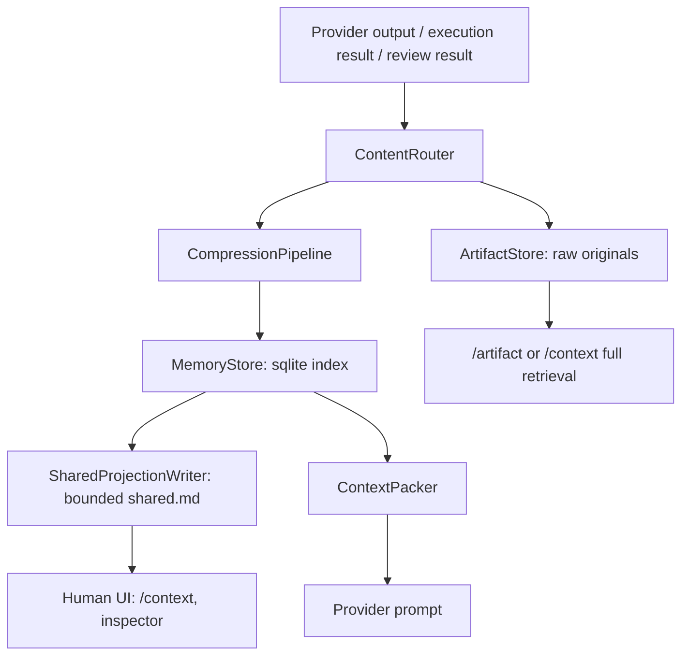

# Headroom 아이디어 기반 shared.md 관리 설계

작성일: 2026-06-09
브랜치: `feature/shared-context-headroom-design`
상태: 설계

## 목표

Trinity의 `.trinity/shared.md`를 무한히 커지는 단일 원장으로 쓰지 않고, 사람이 읽기 쉬운 "현재 상태 투영본"으로 제한한다. 원문, 실행 결과, 리뷰 결과, 로그, 긴 JSON은 별도 아티팩트와 메모리 인덱스에 저장하고, 프롬프트를 만들 때는 토큰 예산 안에서 필요한 기록만 꺼내 쓰는 구조로 바꾼다.

이 설계는 [headroom](https://github.com/chopratejas/headroom)의 아이디어를 차용한다. 핵심은 도구 출력, 로그, 파일, 대화 이력을 그대로 모델에 넣지 않고 타입별로 압축하고, 원문은 로컬에 보존한 뒤 필요할 때 다시 꺼내는 방식이다. Trinity에는 이를 직접 의존성으로 바로 넣기보다, 같은 원칙을 Trinity의 워크플로우와 세션 모델에 맞게 흡수하는 방향이 안전하다.

## 현재 문제

최근 WSL 실행에서 `.trinity/shared.md`가 약 3.3GB까지 커졌고, `resume` 후 `/execute-retry`에서 프로세스가 전조 없이 종료되는 현상이 있었다. 파일 안에는 `## Task Results`가 262,144회 반복되어 있었다.

직접적인 원인은 `SharedContextEngine`의 섹션 append 방식이다.

- `src/trinity/context/shared.py`의 `read()`는 `shared.md` 전체를 한 번에 읽는다.
- `read_section()`은 전체 파일을 읽고 `_parse_sections()`를 수행한다.
- `_parse_sections()`는 섹션 본문에 `## Heading` 줄까지 포함한다.
- `append_to_section()`은 `read_section()` 결과를 다시 `write_section()`에 넘긴다.
- `_replace_section()`은 기존 heading을 보존한 뒤 새 body를 붙인다.
- 그 결과 append할 때마다 heading이 body 안에 중복 저장되고, 반복 실행이나 retry 루프에서 섹션이 폭발적으로 커진다.

구조적 문제도 있다.

- `shared.md`가 상태 저장소, 사람용 리포트, 프롬프트 입력 재료, 실행 로그의 역할을 동시에 맡고 있다.
- 라운드 응답은 이미 원문을 아티팩트로 빼고 참조만 남기는 방향으로 개선되어 있지만, 실행 결과와 하위 작업 결과는 아직 `shared.md`에 많이 의존한다.
- context budget은 존재하지만 실제 shared 파일 크기, 원문 아티팩트, prompt packing을 하나로 관리하는 계층이 없다.
- resume, execute retry, review, context command가 서로 다른 경로에서 상태를 읽기 때문에 "현재 세션에서 필요한 기록"과 "오래된 전체 기록"의 경계가 약하다.

## 현재 코드 지도

핵심 파일은 다음과 같다.

- `src/trinity/context/shared.py`
  - `SharedContextEngine`: `shared.md` 섹션 CRUD.
  - `read()`, `read_section()`, `write_section()`, `append_to_section()`가 전체 파일 기반이다.
  - `append_response_reference()`는 좋은 방향이다. provider 응답 본문 대신 artifact path, status, confidence, token count를 남긴다.
  - `append_task_result()`, `append_subtask_result()`는 실행 결과를 `Task Results`, `Subtasks` 섹션에 계속 누적한다.
  - `get_rounds_for_prompt()`, `get_context_for_rotation()`는 향후 bounded memory retrieval로 바뀌어야 한다.

- `src/trinity/deliberation/protocol.py`
  - 라운드 시작 시 `shared.initialize()`를 호출한다.
  - agent 응답은 `_append_response_reference()`를 통해 아티팩트 참조 중심으로 기록한다.
  - synthesis, consensus, task assignment를 shared에 쓴다.
  - 이미 "원문은 artifact, shared는 요약/참조"라는 패턴의 일부가 들어가 있다.

- `src/trinity/workflow/execution.py`
  - `ExecutionProtocol.run()`이 work package를 실행한다.
  - 결과가 나올 때 `_record_result()`를 거쳐 `shared.append_task_result()`와 `shared.append_subtask_result()` 계열 호출로 이어진다.
  - resume/retry와 결합되면 shared append 버그의 증폭 지점이 된다.

- `src/trinity/workflow/review_execution.py`
  - work package review와 final review를 provider에 보낸다.
  - 리뷰 프롬프트에는 shared 일부와 execution/review 모델 데이터가 섞인다.
  - 리뷰 원문도 artifact + 요약 record 패턴으로 정리할 필요가 있다.

- `src/trinity/context/monitor.py`
  - provider별 context limit 기본값을 가지고 있다.
  - 현재 값은 추정치 성격이 강하므로 실제 provider session/model metadata와 연결되어야 한다.

- `src/trinity/context/budget.py`
  - prompt 문자열 기반 예산 검사만 한다.
  - 앞으로는 `ContextPacker`가 만든 context bundle 기준으로 검사해야 한다.

- `src/trinity/context/compressor.py`
  - 로컬 heuristic 압축기가 있다.
  - Headroom식 타입별 compressor의 첫 구현 기반으로 재사용 가능하다.

- `src/trinity/config.py`
  - context 관련 설정은 rotate threshold, keep sections, recent rounds, summary token, prompt compression 정도만 있다.
  - shared file byte limit, memory index, compaction, retrieval limit 설정이 필요하다.

- `src/trinity/textual_app/app.py`, `src/trinity/tui/session.py`
  - `/context`는 점점 workflow session snapshot 중심으로 옮겨가고 있다.
  - 이 방향은 유지하되, "원문 검색/복원"은 별도 명령으로 분리해야 한다.

## 설계 원칙

1. `shared.md`는 canonical store가 아니다. 사람이 현재 상태를 볼 수 있는 bounded projection이어야 한다.
2. 긴 원문은 artifact로 저장한다. shared에는 `id`, `summary`, `status`, `path`, `token estimate`, `hash`만 남긴다.
3. 모든 긴 기록은 memory index에 등록한다. 검색, dedupe, retrieval은 index를 통해 수행한다.
4. provider prompt는 `shared.read()` 전체 파일로 만들지 않는다. 반드시 `ContextPacker`가 token budget 안에서 조립한다.
5. 압축은 되돌릴 수 있어야 한다. 모델에는 압축본을 주더라도 원문 경로를 남겨 사용자가 확인할 수 있게 한다.
6. 실패 복구가 먼저다. shared가 커졌거나 깨졌을 때 전체 읽기를 시도하지 않고 degraded context mode로 진입해야 한다.
7. 기존 `SharedContextEngine` API는 바로 제거하지 않는다. 내부 구현을 facade로 바꾸어 단계적으로 교체한다.

## 제안 아키텍처



### SharedContextEngine facade

`SharedContextEngine`는 외부 호출부를 위해 유지한다. 내부는 다음 네 계층으로 위임한다.

- `SharedProjectionWriter`
  - `.trinity/shared.md`를 최대 크기 안에서 다시 생성한다.
  - append 기반이 아니라 현재 workflow/session/memory index에서 projection을 재작성한다.
  - 같은 heading이 여러 번 생성되지 않도록 heading registry를 가진다.

- `MemoryStore`
  - SQLite 기반 index.
  - 원문 자체를 DB에 넣지 않고 artifact path, compressed path, hash, metadata를 저장한다.
  - workflow id, Trinity session id, provider session id, agent, work package id, round number로 조회 가능해야 한다.

- `ContentRouter`
  - 입력 타입을 판별한다.
  - 예: `agent_response`, `synthesis`, `execution_result`, `subtask_result`, `review_result`, `final_review`, `log`, `json`, `diff`, `code`, `decision`, `question`.

- `ContextPacker`
  - prompt에 넣을 context bundle을 만든다.
  - goal, agreed conclusion, unresolved questions, current WP, latest decisions, recent synthesis, relevant artifacts summary를 우선순위로 넣는다.
  - token budget을 넘으면 오래된 항목부터 압축본으로 대체하고, 그래도 넘으면 reference만 남긴다.

### MemoryRecord

초기 dataclass는 다음 형태로 둔다.

```python
@dataclass
class MemoryRecord:
    id: str
    workflow_id: str
    trinity_session_id: str
    provider_session_id: str | None
    kind: str
    source: str
    agent: str | None
    provider: str | None
    model: str | None
    round_num: int | None
    work_package_id: str | None
    review_package_id: str | None
    title: str
    summary: str
    artifact_path: str | None
    compressed_path: str | None
    content_hash: str
    token_estimate: int
    importance: int
    tags: list[str]
    created_at: str
    updated_at: str
```

### 저장소 레이아웃

```text
.trinity/
  shared.md
  memory/
    index.sqlite
    manifests/
      <workflow_id>.json
    blobs/
      <sha256>.txt
    compressed/
      <sha256>.md
    projections/
      shared-<workflow_id>.md
  responses/
  execution/
  reviews/
```

`shared.md`는 최신 projection만 가리키는 얇은 파일이어도 된다. 예를 들어 파일 상단에 workflow id, projection generated at, memory stats를 넣고, 중요한 섹션만 사람이 읽을 수 있게 출력한다.

## Headroom 아이디어 적용 방식

Headroom을 그대로 dependency로 넣는 것은 1차 구현 범위에서는 권장하지 않는다. Trinity에는 이미 `PromptCompressor`, workflow persistence, response artifacts, review artifacts가 있으므로 먼저 native 계층을 만든 뒤 선택적으로 adapter를 열어두는 편이 결합도가 낮다.

적용할 아이디어는 다음과 같다.

- Content router
  - 로그, JSON, agent response, diff, code, review result를 같은 방식으로 자르지 않는다.
  - 타입에 따라 요약 방식과 저장 metadata를 다르게 한다.

- Reversible compression
  - prompt에는 압축본을 넣고 원문 artifact id를 항상 같이 남긴다.
  - UI와 command에서 원문을 다시 열 수 있어야 한다.

- Cross-agent memory
  - Claude, Codex, Antigravity, Central Agent가 같은 workflow memory index를 공유한다.
  - provider별 session id는 MemoryRecord에 저장해서 Trinity workflow/session id와 매핑한다.

- Cache-friendly context
  - prompt 앞부분의 stable prefix를 유지한다.
  - current goal, constraints, accepted decisions 같은 고정 항목은 순서와 표현을 안정화한다.
  - 변동 항목은 뒤쪽의 bounded recent/context section에 배치한다.

- Auto dedupe
  - content hash로 같은 실행 결과, 같은 review, 같은 task result 반복 기록을 막는다.
  - retry 시 같은 artifact가 다시 들어오면 새 record를 만들기보다 attempt metadata만 갱신한다.

## 데이터 흐름

### Deliberation

1. 사용자가 prompt를 입력한다.
2. `DeliberationProtocol`이 workflow id와 Trinity session id를 확보한다.
3. 각 agent 응답 원문을 `responses/`에 저장한다.
4. `ContentRouter(agent_response)`가 summary와 metadata를 만든다.
5. `MemoryStore.upsert(record)`가 provider session id, model, token estimate를 함께 저장한다.
6. `SharedProjectionWriter.rebuild()`가 current goal, round synthesis, unresolved questions, response references만 shared에 출력한다.
7. 다음 round prompt는 `ContextPacker.for_deliberation_round()`로 만든다.

### Execution

1. Central Agent가 blueprint와 work package를 만든다.
2. 사용자가 Execute를 누르면 WP별 실행이 시작된다.
3. provider 응답과 command 결과는 `execution/<workflow_id>/<wp_id>/` 아래에 저장한다.
4. `append_task_result()`는 더 이상 긴 내용을 shared에 직접 누적하지 않는다.
5. task summary, files changed, decisions, blockers, follow-up, artifact paths만 memory record로 저장한다.
6. shared projection에는 각 WP별 한 줄 상태와 짧은 요약만 남긴다.

### Review

1. WP 완료 후 reviewer agent가 review result를 만든다.
2. review 원문은 `reviews/<workflow_id>/<review_id>/raw.txt`에 저장한다.
3. severity, findings count, blocking 여부, target WP, reviewer, target agent를 memory index에 저장한다.
4. 해당 WP를 맡았던 agent에게 이어서 보낼 보강 prompt는 `ContextPacker.for_repair()`가 만든다.
5. final review도 같은 방식으로 저장하되 project-level summary로 태깅한다.

### Resume

1. workflow persistence에서 session을 복원한다.
2. memory manifest와 index를 연다.
3. `shared.md` 전체를 읽지 않는다.
4. shared 크기가 limit보다 크면 degraded context mode로 진입하고 projection 재생성을 제안한다.
5. Nexus 화면에는 workflow session snapshot + bounded memory summary를 즉시 보여준다.

## 명령과 UI

기본 명령은 현재 사용자 경험을 해치지 않는 방향으로 확장한다.

- `/context`
  - 현재 workflow의 bounded summary를 보여준다.
  - default로 원문 전체를 펼치지 않는다.

- `/context full <target>`
  - `round-1`, `WP-001`, `review-final`, `agent:codex` 같은 target의 원문 artifact 목록을 보여준다.
  - 큰 파일은 바로 출력하지 않고 크기와 path를 보여준 뒤 열기 여부를 묻는다.

- `/memory stats`
  - shared projection size, memory record count, artifact total size, last compacted at, prompt budget 사용량을 보여준다.

- `/memory compact`
  - 중복 heading, 과대 shared 파일, 오래된 projection을 정리한다.
  - 원문 artifact는 삭제하지 않는다.

- `/artifact <id>`
  - 특정 memory/artifact id의 원문 또는 압축본을 보여준다.

Inspector에는 다음 항목을 추가한다.

- Shared projection size
- Memory records
- Current prompt pack token estimate
- Last compaction
- Degraded context mode 여부
- Current workflow id / Trinity session id / provider session ids

## 설정 추가

`TrinityConfig`의 `[context]`에 다음 값을 추가한다.

```toml
[context]
shared_max_bytes = 1048576
shared_compact_target_bytes = 524288
auto_compact_on_start = true
memory_index_enabled = true
memory_prompt_budget_tokens = 24000
memory_recent_records = 30
memory_retrieval_max_bytes = 262144
compression_mode = "deterministic" # "deterministic" | "headroom" | "off"
repair_max_attempts = 3
```

초기 기본값은 보수적으로 둔다. 특히 `memory_prompt_budget_tokens`는 provider별 실제 context limit을 신뢰하기 전까지 전체 한도의 작은 일부만 사용한다.

## 단계별 작업 계획

### P0: shared.md 폭증 방지와 복구

목표는 즉시 crash 가능성을 없애는 것이다.

- `_parse_sections()`가 heading을 section body에 포함하지 않도록 수정한다.
- `append_to_section()`이 같은 heading을 재삽입하지 않도록 테스트를 추가한다.
- `read()` 전에 파일 크기를 확인하고 limit 초과 시 예외 대신 degraded context summary를 반환하는 경로를 만든다.
- `shared.md`가 과대하면 `.trinity/shared.md.oversized-<timestamp>`로 보존하고 projection을 재생성한다.
- `append_task_result()`, `append_subtask_result()`에 길이 제한을 둔다.
- retry/repair loop의 최대 시도 횟수를 config로 제한한다.

규모: 작음-중간.
결합도: `SharedContextEngine` 호출부가 많지만 public API를 유지하면 낮게 관리 가능하다.

### P1: memory index와 bounded projection

목표는 shared를 canonical store에서 분리하는 것이다.

- `src/trinity/context/memory.py` 추가.
- SQLite schema와 `MemoryRecord` 추가.
- `ArtifactStore` 또는 기존 artifact writer를 감싸는 helper 추가.
- `SharedProjectionWriter` 추가.
- `append_response_reference()`, `append_task_result()`, `append_subtask_result()`를 memory write + projection rebuild로 전환한다.
- execution/review 결과의 raw path와 summary를 memory에 등록한다.
- `/memory stats`, `/memory compact` 명령을 추가한다.

규모: 중간.
결합도: execution, deliberation, review, textual command와 연결되므로 중간.

### P2: ContextPacker와 타입별 압축

목표는 provider prompt가 항상 예산 안에서 필요한 기록만 받게 하는 것이다.

- `src/trinity/context/packing.py` 추가.
- `ContentRouter`와 compression profile 추가.
- JSON pretty summary, log tail/head summary, diff/code summary, review finding summary를 타입별로 구현한다.
- `get_rounds_for_prompt()`와 `get_context_for_rotation()`을 ContextPacker 기반으로 바꾼다.
- provider별 model/session metadata를 MemoryRecord와 연결한다.
- `/context full`, `/artifact <id>`를 추가한다.

규모: 큼.
결합도: prompt 생성 경로와 provider session mapping에 연결되므로 중간-높음.

### P3: Headroom adapter 선택 지원

목표는 외부 compressor를 실험적으로 붙일 수 있게 하는 것이다.

- `compression_mode = "headroom"`일 때만 adapter 사용.
- 실패하면 deterministic compressor로 fallback.
- output은 항상 Trinity MemoryRecord 형식으로 normalize한다.
- 라이선스, 설치 비용, WSL/Windows 호환성을 검증한 뒤 기본값으로 승격할지 판단한다.

규모: 중간.
결합도: adapter 경계만 잘 지키면 낮음.

## 테스트 계획

### Unit

- `SharedContextEngine.append_to_section()`를 1,000회 호출해도 `## Task Results` heading이 한 번만 존재한다.
- 과대 shared file fixture에서 `read()`가 전체 파일을 메모리에 올리지 않고 degraded mode로 전환한다.
- `append_task_result()`가 긴 output을 잘라서 artifact reference만 남긴다.
- `MemoryStore.upsert()`가 같은 `content_hash`를 dedupe한다.
- `ContextPacker`가 token budget을 넘기지 않는다.
- JSON record는 pretty formatted summary를 만든다.

### Integration

- deliberation 2 round 후 shared projection 크기가 limit 이하로 유지된다.
- execution retry를 여러 번 실행해도 shared size가 선형으로만 증가하거나 projection 재생성으로 고정된다.
- resume 후 `/context`가 workflow snapshot과 bounded memory summary를 즉시 보여준다.
- `/context full WP-001`이 원문 artifact를 찾을 수 있다.
- WP review, repair, final review 결과가 memory index에 연결된다.

### Regression

- 기존 `.trinity/shared.md`에 중복 heading이 많은 fixture를 넣고 `/memory compact`가 복구한다.
- WSL에서 oversized shared가 있어도 `trinity` 시작, `resume`, `/execute-retry`가 종료되지 않는다.
- provider output이 큰 JSON, 긴 로그, 긴 diff일 때 UI와 inspector가 멈추지 않는다.

## 수용 기준

- `shared.md`는 기본 설정에서 1MB를 넘기지 않는다.
- 같은 workflow에서 retry를 10회 반복해도 heading 중복이 생기지 않는다.
- prompt builder는 `shared.md` 전체를 직접 읽지 않는다.
- 원문 artifact는 command로 다시 열 수 있다.
- resume 직후 `/context` 없이도 Nexus에 이전 session summary가 보인다.
- `/memory stats`에서 context health를 확인할 수 있다.
- 과대 shared 파일이 있어도 Trinity가 종료되지 않고 복구 안내를 표시한다.

## 리스크와 대응

- 기존 코드가 `shared.read()`의 전체 markdown 반환을 기대할 수 있다.
  - 대응: P0에서는 API를 유지하고 size guard만 추가한다. P1부터 내부 구현을 facade로 바꾼다.

- 압축이 중요한 결정을 누락할 수 있다.
  - 대응: decisions, blockers, unresolved questions, accepted conclusion은 항상 pinned record로 유지한다.

- SQLite index가 깨질 수 있다.
  - 대응: artifact directory와 workflow persistence에서 index를 재생성하는 repair command를 제공한다.

- provider별 실제 context 한도와 사용량 신뢰도가 낮다.
  - 대응: provider session id, model, usage metadata를 record에 저장하고, 알 수 없는 값은 추정치로 표시한다.

- Headroom 직접 dependency가 플랫폼 문제를 만들 수 있다.
  - 대응: deterministic native compressor를 기본으로 두고 adapter는 opt-in으로 둔다.

## 구현 순서 권장안

1. P0를 먼저 끝내서 crash와 파일 폭증을 막는다.
2. P1로 memory index와 projection을 넣는다.
3. resume, execute retry, review command에서 memory index를 사용하게 연결한다.
4. P2에서 ContextPacker를 prompt 생성 경로에 넣는다.
5. Headroom adapter는 실험 옵션으로 마지막에 붙인다.

이번 설계의 핵심은 shared 파일을 없애는 것이 아니라 역할을 줄이는 것이다. `shared.md`는 사람이 보는 현재판, memory index는 기계가 찾는 기록, artifact는 원문 보관소로 나누면 Trinity가 긴 실행과 resume/retry를 버틸 수 있다.
