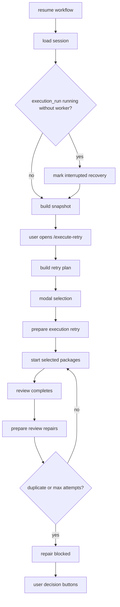

# Resume Execute-Retry Performance Design

작성일: 2026-06-09
브랜치: `feature/resume-retry-performance-design`
기준 브랜치: `main`

## 배경

사용자가 오래 실행된 워크플로우를 `resume`으로 불러온 뒤 `/execute-retry`를 실행하면 Nexus 화면과 모달 조작이 심하게 느려지는 현상이 있다. 특히 리뷰 이후 보강 실행이 반복된 세션에서는 work package, review, execution event, provider output, shared context가 모두 누적된다. 현재 구조는 resume 이후 UI snapshot을 자주 다시 만들고, snapshot 생성 과정에서 이벤트 로그와 실행 결과를 여러 번 훑을 수 있어 오래된 세션일수록 터미널 입력이 밀릴 가능성이 크다.

이번 작업의 목표는 단순히 `/execute-retry` 버튼을 빠르게 만드는 것이 아니라, 오래된 실행 세션을 다시 불러와도 UI가 멈추지 않고 사용자가 다음 행동을 명확히 선택할 수 있는 복구 흐름을 만드는 것이다.

## 현재 구조 관찰

`TextualWorkflowController`는 background thread에서 deliberation, execution, review를 실행하고 `drain_updates()`에서 완료 결과를 workflow engine에 반영한다. review 결과에 `CHANGES_REQUESTED`가 있으면 `prepare_review_repairs()`로 work package를 다시 pending 상태로 만들고 곧바로 execution을 재시작한다.

`NexusSnapshotAdapter`는 현재 workflow session과 provider 상태를 읽어 `WorkflowNexusSnapshot`으로 투영한다. 실행 로그와 workflow event는 persistence event log를 다시 읽어 현재 workflow id로 필터링하는 방식이다. Snapshot은 화면 poll마다 다시 만들어질 수 있으므로, 큰 세션에서는 `load_events()` 반복 호출과 문자열 formatting이 체감 렉으로 이어질 수 있다.

`/execute-retry`는 engine의 retry plan을 기반으로 modal을 만든다. retry 후보는 failed, blocked, interrupted, running 상태의 work package에서 나오며, custom 선택은 모달에서 checkbox로 고른다. 하지만 오래된 세션에서 package와 event가 많으면 plan 생성, row render, snapshot refresh가 같은 시점에 겹쳐 입력 지연을 만들 수 있다.

현재 `main` 기준으로 확인한 근거는 다음과 같다.

- `TextualWorkflowController.resume_workflow()`는 archive restore 후 이미 `detect_interrupted_execution(worker_running=False)`를 호출한다. 따라서 이번 작업은 resume 복구의 신규 도입이 아니라, 복구 상태를 UI와 retry 흐름에 일관되게 유지하는 보강이다.
- `WorkflowEngine.build_execution_retry_plan()`도 `detect_interrupted_execution(worker_running=False)`를 호출한다. 즉 `/execute-retry`를 열 때도 state mutation 가능성이 있고, 오래된 세션에서는 plan 생성이 단순 조회처럼 동작한다고 보기 어렵다.
- `WorkflowEngine.prepare_review_repairs()`는 같은 package에 대한 반복 review repair를 막는 signature나 attempt count 없이 `PENDING`으로 되돌린다.
- `NexusSnapshotAdapter._execution_log()`, `_workflow_events()`, `_last_session_event()`는 각각 `persistence.load_events()`를 호출한다. 한 번의 snapshot 구성에서 event log 전체 읽기가 여러 번 발생할 수 있다.
- `ExecutionRetryModal._display_packages()`는 `all`과 `custom`에서 전체 `work_package_details`를 표시한다. retryable이 아닌 package도 row로 들어가므로 큰 blueprint에서 modal 렌더링 비용이 커질 수 있다.

## 문제 정의

1. Resume 후 active execution run이 실제 worker 없이 `running`으로 남아 있으면 UI는 계속 실행 중처럼 보이거나 retry 흐름이 불안정해진다. 현재 resume에서 interrupted 감지는 수행하지만, 이후 retry plan과 snapshot에서 이 상태를 계속 가볍게 재사용하는 구조가 약하다.
2. Review가 같은 필수 수정사항을 반복해서 반환하면 repair execution이 다시 시작되고, review가 또 같은 결과를 만들면서 자동 반복이 생길 수 있다.
3. Snapshot 생성 중 이벤트 로그를 여러 번 전체 순회하면 오래된 세션에서 UI poll 비용이 급격히 증가한다.
4. `/execute-retry` modal은 retry 후보가 많은 세션에서 한 번에 모든 row와 설명을 렌더링하므로 키보드 이동과 스크롤이 무거워질 수 있다.
5. 자동 보강이 막혔을 때 사용자가 "한 번 더 재시도", "이 정도면 완료 처리", "리뷰 내용 확인", "중단" 중 무엇을 할 수 있는지 UI가 명확해야 한다.

## 목표

- Resume 직후 실행 worker가 없는 running 상태를 interrupted/recovery 상태로 정리한다.
- 같은 review repair 요구가 무한 반복되지 않도록 package 단위 guard를 둔다.
- Snapshot 생성에서 active workflow event를 한 번만 읽고, 화면에 필요한 tail 범위만 formatting한다.
- `/execute-retry` modal은 오래된 세션에서도 빠르게 열리고 키보드 이동/스크롤이 안정적으로 동작한다.
- Review repair가 막힌 경우 중앙 에이전트 영역에서 사용자가 다음 결정을 내릴 수 있게 한다.

## 제외 범위

- Provider CLI 명령어와 provider session 매핑 방식 변경.
- Event storage를 SQLite 등으로 전면 이전하는 작업.
- 전체 Textual layout 재설계.
- Work package 자동 생성/분해 로직 변경.

## 설계

### 1. Resume 상태 복구 보강

현재 `TextualWorkflowController.resume_workflow()`는 archive restore 후 `detect_interrupted_execution(worker_running=False)`를 호출한다. 이 흐름을 유지하되, 아래처럼 복구 결과를 이후 UI와 retry plan에서 재계산 없이 재사용할 수 있게 만든다.

- `execution_run.state == "running"`이고 현재 controller worker가 없으면 `detect_interrupted_execution(worker_running=False)`를 실행한다.
- running package는 `interrupted` retry 후보로 남긴다.
- UI snapshot은 `ExecutionRecoverySnapshot(state="interrupted")`를 표시한다.
- 사용자가 `/execute-retry`를 실행하면 interrupted 후보가 modal에 바로 보인다.
- `/execute-retry` plan 생성은 가능하면 이미 persisted된 `execution_run.state == "interrupted"`와 package status를 읽는 순수 조회로 동작하게 한다.
- state mutation이 필요한 stale running 감지는 resume 또는 명시적 recovery command에서만 수행한다.

이 단계는 resume 시 한 번만 수행하고, 단순 snapshot 조회에서는 workflow state를 mutate하지 않는다.

### 2. Review repair loop guard

`WorkPackage`에 repair metadata를 추가한다.

- `repair_attempt_count`: 이 package에 review repair를 적용한 횟수.
- `last_repair_signature`: 마지막 repair 요구사항의 안정적인 hash.
- `last_repair_review_id`: 마지막으로 repair를 유발한 review package id.
- `repair_blocked_reason`: 자동 repair가 막힌 이유.
- `repair_blocked_at`: block timestamp.

`WorkflowEngine.prepare_review_repairs()`는 review result를 package id별로 묶어서 처리한다.

- 같은 batch에서 여러 reviewer가 같은 package에 수정을 요구하면 attempt는 한 번만 증가한다.
- `required_changes`를 normalize, dedupe, sort한 뒤 package id와 target agent를 포함해 signature를 만든다.
- 이전 signature와 같은 요구가 다시 들어오면 자동 재시작하지 않고 `duplicate_required_changes`로 blocked 처리한다.
- attempt가 `repair_max_attempts` 이상이면 `max_attempts_exceeded`로 blocked 처리한다.
- 일부 package는 retry 가능하고 일부는 blocked인 mixed batch를 허용한다. 이때 retry 가능한 package만 실행하고 blocked package는 중앙 UI에 남긴다.

### 3. 사용자 결정 액션

Repair blocked 상태에서는 중앙 에이전트 영역에 action button을 표시한다.

- `Retry once`: 사용자가 명시적으로 한 번 더 재시도한다. 이 경우 duplicate guard를 우회하되 attempt count는 유지/증가시킨다.
- `Mark done`: 사용자가 review repair 요구를 수용하지 않고 완료로 처리한다.
- `Open review`: `/review` 결과를 열어 어떤 요구 때문에 막혔는지 확인한다.
- `Stop`: workflow를 실패/중단 상태로 정리한다.

이 액션은 local command routing과 동일한 경로를 쓰되, engine에는 명시적인 intent method를 둔다.

### 4. Snapshot 성능 개선

`NexusSnapshotAdapter.load_snapshot()` 안에서 현재 workflow event를 한 번만 읽고 하위 helper에 전달한다. 현재 `_execution_log()`, `_workflow_events()`, `_last_session_event()`가 각각 `load_events()`를 호출하므로, 같은 render tick에서 전체 JSONL 파일을 중복 순회할 수 있다.

권장 API:

```python
session_events = self.persistence.load_events_for_workflow(session.id, tail=None)
```

우선 구현은 JSONL 전체를 읽더라도 snapshot 내부에서는 한 번만 순회한다. 이후 필요하면 persistence level에서 tail streaming으로 줄인다.

화면 표시에는 다음 제한을 둔다.

- execution log: 최근 80개 event + 최근 10개 execution result.
- workflow event: 최근 N개 또는 inspector에서만 전체 보기.
- repair note: 최근 8개 + blocked summary.
- provider raw output/artifact: 카드 summary에는 짧은 excerpt만 표시하고, inspector에서 상세를 연다.

### 5. `/execute-retry` modal 최적화

Retry plan은 engine에서 순수 데이터로 만들고, modal은 이미 계산된 plan만 렌더링한다.

- `all`, `failed`, `blocked`, `interrupted`, `custom` filter는 plan 생성 결과를 재사용한다.
- custom 선택 시 row 옆 checkbox를 표시하고 depth가 깊어지지 않게 한다.
- modal row는 id, status, owner, topic, retry note만 표시한다.
- 긴 review summary나 blocker 전문은 modal에 넣지 않고 inspector/detail command로 보낸다.
- 키보드 이동 시 highlighted row가 viewport 안에 오도록 scroll offset을 보정한다.
- `all`과 `custom`도 전체 work package 대신 retry plan 후보 중심으로 표시한다. 필요하다면 "show non-retryable" 토글을 별도로 둔다.

### 6. Event persistence 확장

첫 구현은 기존 JSON event log를 유지한다. 다만 다음 helper를 추가해 snapshot과 engine이 같은 filtering 코드를 중복하지 않게 한다.

- `load_events_for_workflow(workflow_id: str, tail: int | None = None, event_names: set[str] | None = None)`
- `last_event_for_workflow(workflow_id: str)`
- `append_event()`는 repair guard event에 `repair_signature`, `repair_attempt_count`, `blocked_reason`을 남긴다.

### 7. UI 상태 표시

Central Agent 영역:

- `State: needs_user_decision` 또는 `Execution recovery: repair_blocked`를 표시한다.
- blocked package 목록은 id, owner, attempt, reason을 짧게 보여준다.
- action button은 repair blocked 상태에서만 보인다. 단순 executing mixed state에서는 버튼을 숨겨 실행 중 판단을 방해하지 않는다.

Inspector:

- `Execution Log`는 tail임을 명시한다.
- 필요한 경우 `/context`, `/review`, `/packages`로 상세를 열 수 있다.

## 데이터 흐름



## 테스트 계획

Engine tests:

- running execution with no worker is detected as interrupted on resume.
- duplicate repair signature blocks automatic retry.
- max repair attempts blocks automatic retry.
- same package, same review batch, multiple reviewers increments attempt once.
- mixed selected and blocked repair batch keeps selected retryable package running.
- accept/stop/retry-once actions persist expected events.

Textual controller tests:

- resume triggers recovery context without requiring manual `/context`.
- `/execute-retry` after resume opens recovery modal instead of starting full blueprint execution.
- target workspace required outcome opens the workspace picker without losing selected retry candidates.
- blocked repair action routes from Central Agent button to controller method.

Snapshot/UI tests:

- snapshot loads session events once per render in a synthetic large event fixture.
- execution log is tail-limited.
- retry modal filters `all`, `failed`, `blocked`, `interrupted`, `custom`.
- keyboard navigation scrolls the modal list.
- central repair action buttons appear only in repair blocked state.

Performance regression:

- synthetic workflow with 100 work packages and 5,000 events.
- `load_snapshot()` target: under 300 ms on WSL dev machine.
- `/execute-retry` plan and modal mount target: under 300 ms.
- no unbounded artifact reads during normal Nexus polling.

## 구현 순서

1. Persistence helper와 snapshot event single-pass 구조를 먼저 추가한다.
2. Resume reconcile을 controller/workflow boundary에 추가한다.
3. WorkPackage repair metadata와 `prepare_review_repairs()` guard를 추가한다.
4. Repair blocked user action API를 engine과 controller에 연결한다.
5. Central Agent repair action UI와 `/execute-retry` modal 표시를 정리한다.
6. Synthetic performance fixture와 regression tests를 추가한다.

## 구현 진행 현황

2026-06-09 현재 이 브랜치에서 1차 구현을 진행했다.

- `WorkPackage`에 review repair attempt/signature/block metadata를 추가했다.
- `WorkflowEngine.prepare_review_repairs()`가 package 단위로 review 결과를 묶고, duplicate required changes와 max attempts를 자동 repair block으로 전환한다.
- resume/controller 초기화 시 legacy repair metadata를 reconcile해 오래된 세션의 반복 repair loop를 감지한다.
- Central Agent 영역에 blocked repair 사용자 액션을 연결했다: retry once, mark done, open review, stop.
- `/execute-retry`는 repair metadata와 blocked note를 표시하고, recovery-only 후보도 fallback row로 보여준다.
- `WorkflowPersistence.load_events_for_workflow()`와 `last_event_for_workflow()`를 추가했다.
- `NexusSnapshotAdapter.load_snapshot()`은 한 번 읽은 workflow event 목록을 execution log, workflow event, execution recovery projection에 재사용한다.
- 테스트는 repair guard, blocked action routing, recovery fallback, snapshot event single-pass, persistence helper를 포함하도록 확장했다.

## 수용 기준

- 오래된 세션을 resume해도 Nexus 입력이 눈에 띄게 밀리지 않는다.
- `/execute-retry` 실행 시 Trinity가 종료되거나 WSL 세션이 닫히지 않는다.
- 같은 review repair 요구가 반복되면 자동 실행 루프가 멈추고 사용자 결정 UI가 뜬다.
- 사용자는 blocked repair에 대해 retry once, mark done, open review, stop 중 하나를 선택할 수 있다.
- 모든 변경은 기존 `uv run pytest -q`를 통과한다.

## 리스크와 완화

- Event tail 제한으로 사용자가 과거 로그가 사라졌다고 느낄 수 있다. Inspector나 report/export에서는 전체 로그 접근을 유지한다.
- Resume reconcile이 상태를 mutate하므로, active worker가 실제로 살아 있는 경우를 잘못 interrupted로 만들면 안 된다. Controller의 `is_running`과 persisted run state를 함께 확인한다.
- Repair duplicate signature가 너무 엄격하면 실제 다른 수정 요구를 막을 수 있다. Signature에는 normalized required changes 전체와 target agent/package id를 포함한다.
- Retry once는 guard를 우회하므로 무한 반복을 다시 만들 수 있다. 명시적 사용자 액션에만 허용하고 attempt count를 계속 기록한다.
